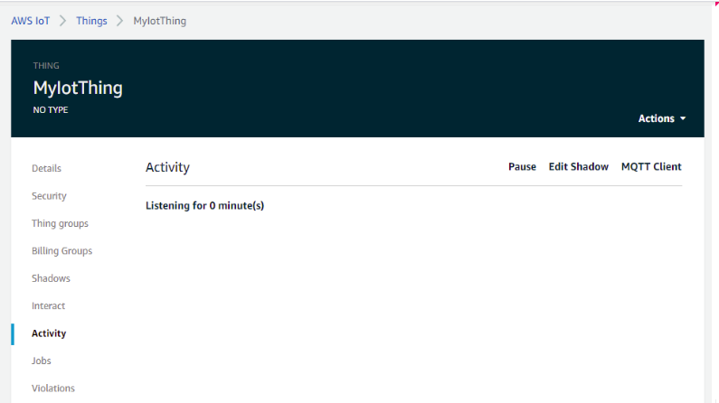
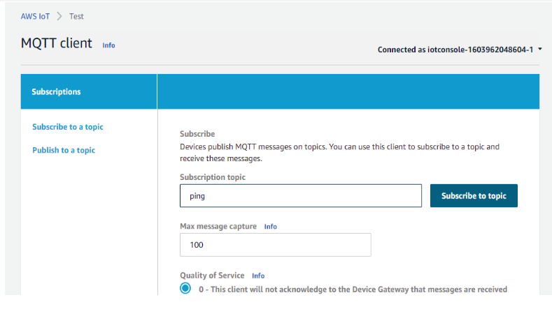
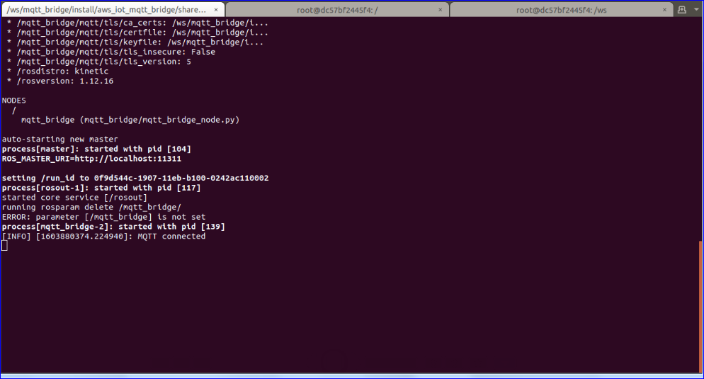
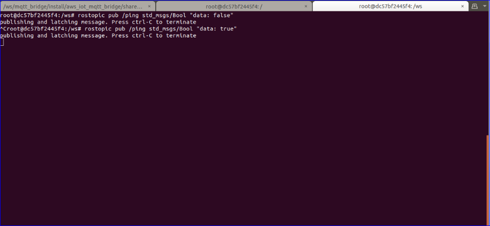
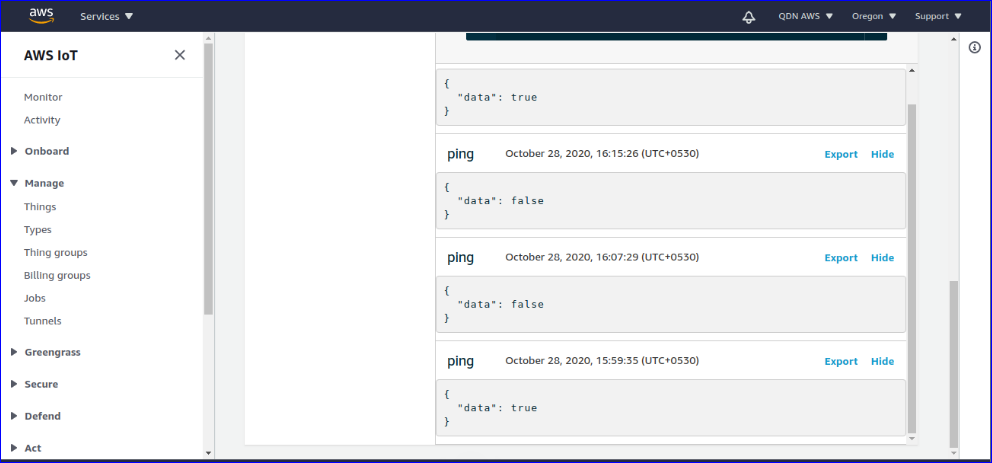
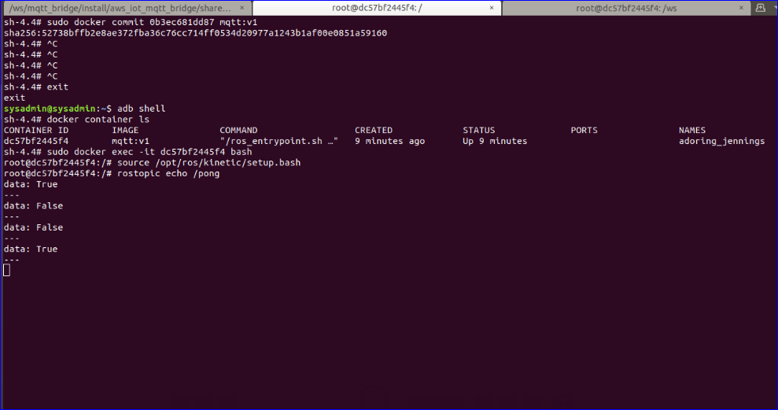

### Introduction
The aws_iot_mqtt_bridge package contains configuration and launch files to integrate a robot running ROS with AWS IoT by using the mqtt_bridge package. The mqtt_bridge acts as a bridge between ROS systems and servers running the MQTT protocol.

This application needs security certificate installation and many settings related to setting up mqtt-bridge and can create a powerful interface whereby robot’s sensor information and other monitoring parameters can be directly injected into AWS IoT Core from ROS. This application is currently available on ROS1 Kinetic only.

The instructions below demonstrate the porting and working of aws-iot-bridge-example on Qualcomm Robotics RB5


1. Create ROS kinetic docker image (with all dependencies) on Qualcomm Robotics RB5

    i.Create a ROS workspace and a source directory
    ```
    docker pull ros:kinetic-ros-base-xenial
    sudo docker run -v $(pwd):/yourdir  -it ros:kinetic-ros-base-xenial
    ```
   - Install utilities:
   ```
    apt-get update && apt-get install -y vim
    apt-get install unzip
    apt-get install curl
    apt install python-pip
    sudo sh -c 'echo "deb http://packages.ros.org/ros/ubuntu `lsb_release -cs` main" > /etc/apt/sources.list.d/ros-latest.list'
    sudo apt-key adv --keyserver 'hkp://keyserver.ubuntu.com:80' --recv-key C1CF6E31E6BADE8868B172B4F42ED6FBAB17C654
    sudo apt update
    sudo apt install python3-colcon-common-extensions
    ```
    
    - Commit container to a new image (roskinetic:v1):
    ```
    docker commit [OPTIONS] CONTAINER [REPOSITORY[:TAG]]
    ```
2. AWS CLI configuration in ROS Kinetic docker container on Qualcomm Robotics RB5

    The prerequisite step "e) Configure AWS CLI in Qualcomm Robotics RB5"  under  "4. Set up role and get Access keys through AWS CLI" in prerequisites needs to be modified as below, as this sample app runs in a docker container unlike all other sample apps.
    - Enter the docker container created in the step above, and configure AWS CLI in it
    ```
    sudo docker run -v $(pwd):/yourdir  -it roskinetic:v1
    ```
    ```
    aws configure 
    AWS Access Key ID [None]: _AKIAIOSFODNN7EXAMPLE_
    AWS Secret Access Key [None]: _wJalrXUtnFEMI/K7MDENG/bPxRfiCYEXAMPLEKEY_
    Default region name [None]: _us-west-2-example_
    Default output format [None]: _json_
    ```
    
    
3. Setup AWS IoT Thing

    The steps below can be executed on a LINUX host (not RB5)
    
    i. Follow the steps 1,2 and 3 in the
    
    link-http://docs.aws.amazon.com/iot/latest/developerguide/iot-quick-start.html
    
    ii. A zip file connect_device_package.zip with certificates is downloaded
    
    iii. Unzip connect_device_package.zip to a folder named “certs”
    run ./start.sh, this creates a root-CA.crt file in current folder
    
    iv. Rename/move the files as shown below
    ```
    root-CA.crt -> AmazonRootCA1.pem
    MyIotThing.cert.pem ->  device.cert.pem 
    MyIotThing.private.key ->   device.private.pem
    ```
    
4. Steps to Clone Application 

    i. Enter the ROS Kinetic docker container previously created and configured:
    ```
    sudo docker run -v $(pwd):/yourdir  -it roskinetic:v1
    ```
    ii. Create a ROS workspace and a source directory
    ```
    mkdir -p ~/ros-workspace/src 
    cd ~/ros-workspace/src
    ```
    iii. Clone the app
    ```
    git clone https://github.com/aws-robotics/aws-iot-bridge-example.git -b release-v1
    ```
    iv. The package.xml in this source seems to be outdated. The following changes are required in package.xml. 
    ```
    vim ~/ros-workspace/src/aws-iot-bridge-example/aws_iot_mqtt_bridge/package.xml
    ```
    Change the last 2 lines as follows:
    <depend>_python-msgpack_</depend>
    <depend>_python-pymongo_</depend>
    
    v. Now prepare for build by installing dependencies:
    ```
    cd ~/ros-workspace 
    apt-get update && rosdep update
    rosdep install --from-paths src --ignore-src -r -y
    ```
    
    vi. rosdep fails as the python “inject” package cannot be installed. After rosdep completes, run following command:
    ```
    pip install inject==3.*  
    ```
    vii. Copy “certs” folder ( created in 3) Setup AWS IoT Thing) with all its contents to:
    ```
    ~/ros-workspace/src/aws-iot-bridge-example/aws_iot_mqtt_bridge/config
    ```
    viii. Create a file called my_bridge_params.yaml in folder
    ~/ros-workspace/src/aws-iot-bridge-example/aws_iot_mqtt_bridge/config and insert following contents into it:
    bridge:
    ```
    # ping pong
    - factory: mqtt_bridge.bridge:RosToMqttBridge
    msg_type: std_msgs.msg:Bool
    topic_from: /ping
    topic_to: ping
    - factory: mqtt_bridge.bridge:MqttToRosBridge
    msg_type: std_msgs.msg:Bool
    topic_from: ping
    topic_to: /pong
    ```
    
    ix. Rename/move example_aws_iot_params.yaml to aws_iot_params.yaml in folder
    ```
    ~/ros-workspace/src/aws-iot-bridge-example/aws_iot_mqtt_bridge/config
    ```
    
    x. Query the endpoint:
    ```
    aws iot describe-endpoint --endpoint-type iot:Data-ATS
    ```
    
    xi. Change following settings as shown below in the file aws_iot_params.yaml created in step ix.
    ca_certs =>
    ```
    ~/ros-workspace/install/aws_iot_mqtt_bridge/share/aws_iot_mqtt_bridge/config/certs/AmazonRootCA1.pem
    ```
    certfile =>
    ```
    ~/ros-workspace/install/aws_iot_mqtt_bridge/share/aws_iot_mqtt_bridge/config/certs/device.cert.pem
    ```
    keyfile=> 
    ```
    ~/ros-workspace/install/aws_iot_mqtt_bridge/share/aws_iot_mqtt_bridge/config/certs/device.private.pem
    ```
     host=> endpoint obtained in step ix 

5. Build Application 
    ```
    source  /opt/ros/dashing/setup.bash
    cd ~/ros-workspace && colcon build
    source ~/ros-workspace/install/setup.bash
    export HOME=/root
    ```
6. Steps to execute application

    From AWS console, go to “IoT Core”, Choose “Manage->Things” from the left pane of IoT Core service. Choose “MyIotThing” from the things list on the right. Click on “Activity” and then click on “_MQTT Client_” (to the right of the screen). 
    
    
    [Alt tag: ”IotThing”]
    
    i. In the page below you’ll be able to subscribe to an MQTT topic where our ROS application can post messages (through the MQTT-BRIDGE).  Type “ping” in “Subscription topic” and click on “Subscribe to Topic” as in the screenshot below:
    
    
    [Alt tag: ”MQTT Client”]

    ii. On the Qualcomm Robotics RB5, while in the same build terminal, execute following command to start the node:
    ```
    roslaunch aws_iot_mqtt_bridge aws_iot_bridge.launch bridge_params:=~/ros-workspace/install/aws_iot_mqtt_bridge/share/aws_iot_mqtt_bridge/config/my_bridge_params.yaml
    ```
    You may need following command to enable certificate permissions:
    ```
    sudo chown -R $USER /root (or home)/ 
    ```
    iii. Start a 2nd terminal and type following commands (use “docker exec -it  [container id of image launched through docker run for 1st terminal] bash ”):
    ```
    source  /opt/ros/dashing/setup.bash 
    rostopic echo /pong
    ```
    iv. Start a 3rd terminal and type following commands (use “docker exec -it  [container id of image launched through docker run for 1st terminal] bash ”):
    ```
    source  /opt/ros/dashing/setup.bash
    rostopic pub /ping std_msgs/Bool "data: true"
    ```
    
    You’ll notice that the 2nd terminal and AWS console echo the data published on ROS /ping topic. This is as per our mqtt-bridge configuration specified in  
    **~/ros-workspace/install/aws_iot_mqtt_bridge/share/aws_iot_mqtt_bridge/config/my_bridge_params.yaml.
    ROS topic (/ping) ==> aws mqtt topic (ping)
    mqtt topic (ping) ==> ROS  topic (/pong)
    ==> Represents a one-way bridge here**
    
7. Screenshots of application execution

    
    [Alt tag: ”Running the node”]
    
    
    [Alt tag: ”Publishing the ping topic”]
    
    
    
    [Alt tag: ”AWS IoT dashboard reflecting the published data in ping topic”]
    
    
    [Alt tag: ”Data of pong subscribed topic”]
    

For more information regarding this please refer below link:    
https://github.com/aws-robotics/aws-iot-bridge-example/


