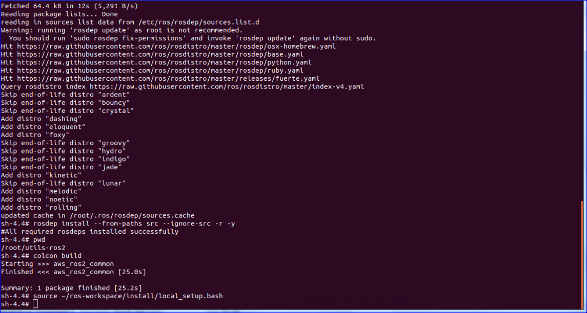

### Introduction
This is the common library for all of AWS RoboMaker ROS2 packages. It builds on top of the generic interfaces defined by utils-common to provide ROS2-specific helper functions and classes implementations for things such as logging and parameter loading.
This app does not require any permissions to be set.

1. Clone the application

    i.Create a ROS workspace and a source directory
    ```
    mkdir -p ~/ros-workspace/src 
    cd ~/ros-workspace/src
    ```
    ii. Clone the utils-ros2 app
    ```
    git clone https://github.com/aws-robotics/utils-ros2.git -b release-latest
    cd ~/ros-workspace 
    apt-get update && rosdep update
    rosdep install --from-paths src --ignore-src -r -y

    ```
2. Build the utils-ros2 app
    ```
    source  /opt/ros/dashing/setup.bash
    cd ~/ros-workspace && colcon build
    source ~/ros-workspace/install/local_setup.bash
    ```
3. Execution outputs of the utils-ros2 app
    
    

For more information regarding this please refer below link:
https://github.com/aws-robotics/utils-ros2


