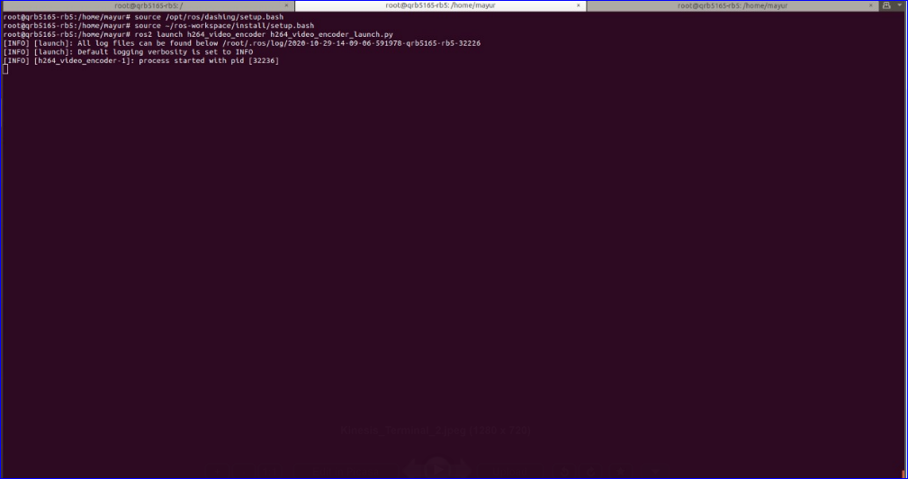
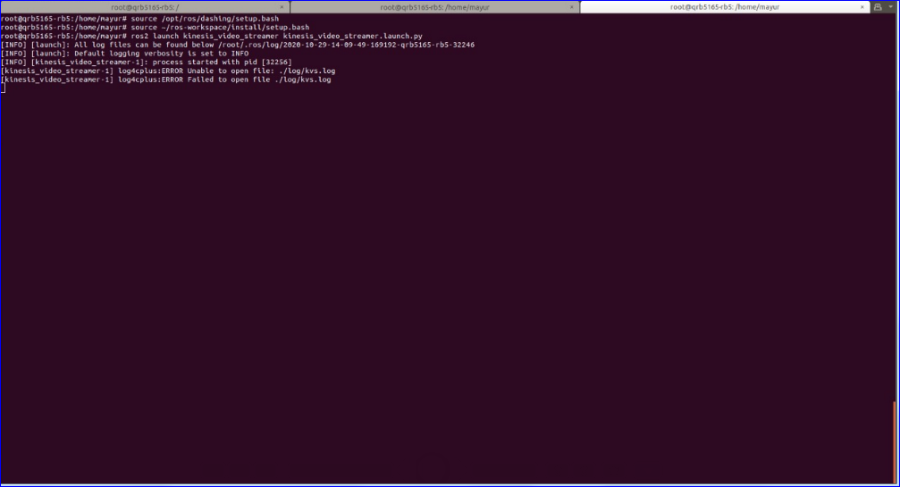

### Introduction
The Kinesis Video Streams ROS package enables robots to stream video to the cloud for analytics, playback, and archival use. Out-of-the-box this application is designed for Raspberry Pi3. The instructions feed video streams from USB camera to the kinesis ROS node on the Qualcomm Robotics RB5

The kinesisvideo-ros2 node requires an IAM User with the permissions listed below

1. Add the following permissions to IAM user
 i. Select the IAM user created earlier, click Add permission, then tap Attach existing policies directly and then select the Create policy and paste the JSON snippet given below.
    ```
    {
        "Version": "2012-10-17",
        "Statement": [
            {
                "Effect": "Allow",
                "Action": [
                    "kinesisvideo:CreateStream",
                    "kinesisvideo:TagStream",
                    "kinesisvideo:DescribeStream",
                    "kinesisvideo:GetDataEndpoint",
                    "kinesisvideo:PutMedia",
                   "kinesis:ListShards",
                                  "kinesis:GetShardIterator",
                                  "kinesis:GetRecords"
                ],
                "Resource": [
                    "*"
                ]
            }
        ]
    }
    ```
    ii. Give name to policy, go to _Review policy_ and select _Create policy_.
    iii) Add the created policy to the IAM user by searching the policy name. Follow the steps below
    Go to the created user -> Add permission -> Attach existing policies directly -> search and select the created policy -> Next:review -> Add permission

2.  Create a ROS workspace and a source directory and clone the apps
    ```
    mkdir -p ~/ros-workspace/src 
    $ cd ~/ros-workspace/src
    ```
- Clone the ros2_usb_camera app
    ```
    git clone https://github.com/klintan/ros2_usb_camera.git
    ```
- Clone the source code of kinesisvideo, kinesisvideo-encoder, kinesisvideo-common.
    ```
    git clone https://github.com/aws-robotics/kinesisvideo-ros2.git -b release-latest
    git clone https://github.com/aws-robotics/kinesisvideo-encoder-ros2.git
    git clone https://github.com/aws-robotics/kinesisvideo-common.git -b release-latest
    ```

3. Steps to build the cloned apps

    i. Create the video stream in AWS                          
        Go to the link- https://us-west-2.console.aws.amazon.com/kinesisvideo/home?region=us-west-2#/streams and select ‘Create video stream’, enter a name, choose Default configuration and create video stream. 
        AWS Video Stream Dashboard
        
        Open a terminal in Qualcomm Robotics RB5 and follow the steps below
        
    ii. Modify the configuration file- config/sample_config.yaml in kinesisvideo-ros2 application, to reflect the new video stream created in the previous step.
    ```
    cd~/ros-workspace/src/kinesisvideo-ros2/kinesis_video_streamer/config/sample_config.yaml
    vim sample_config.yaml
    ```
    Change the 2 parameters shown below and save changes 
    sample_config:
    region: _"us-west-2"_
    stream_name: _"video"_
    
    iii. Modify the configuration file- config/sample_configuration.yaml  in kinesisvideo-encoder-ros2 application, to specify the USB camera image topic name
    ```
    cd ~/ros-workspace/src/kinesisvideo-encoder-ros2/h264_video_encoder/config
    vim sample_configuration.yaml
    ```
    Change the parameter shown below and save changes
    sample_configuration: 
    subscription_topic: _"/usb_camera_driver/image"_
    
    iv. Install dependencies and update
    ```
    cd ~/ros-workspace 
    source  /opt/ros/dashing/setup.bash
    apt-get update 
    apt-get upgrade && rosdep update
    rosdep install --from-paths src --ignore-src -r -y
    ```
    v. Build the application
    ```
    cd ~/ros-workspace && colcon build
    source ~/ros-workspace/install/local_setup.bash
    colcon test --packages-select kinesis_video_streamer && colcon test-result --all
    ```
4. Execute the application

i. Run the USB camera node in terminal1 for enabling the USB camera
    ```
    source /opt/ros/dashing/setup.bash
    source ~/ros-workspace/install/local_setup.bash
    ros2 run usb_camera_driver usb_camera_driver_node __ns:=/<your namespace> __params:=config.yaml
    ```
    Replace <your namespace> with usb_camera_driver and params with your usb camera config.yaml file path in the above command, so the final command will be like below
    ros2 run usb_camera_driver usb_camera_driver_node __ns:=/usb_camera_driver __params:=/root/ros-workspace/src/ros2_usb_camera/config/config.yaml
    
    ii. Launch the h264 video encoder in terminal2
    ```
    source /opt/ros/dashing/setup.bash
    source ~/ros-workspace/install/local_setup.bash
    ros2 launch h264_video_encoder h264_video_encoder_launch.py
    ```
5. Application execution outputs

    Terminal 1 : Launching USB camera node
    
    
    Terminal 2 : Launching h264 Video encoder node
    
    
     Terminal 3 : Launching the Kinesis video stream node
     
     
     Image :  Video stream in AWS Dashboard
     

For more information regarding this please refer Launch File section in below link https://github.com/aws-robotics/cloudwatchlogs-ros2/

Please find the AWS video stream link below:
https://youtu.be/9_hbR7LIrTg


