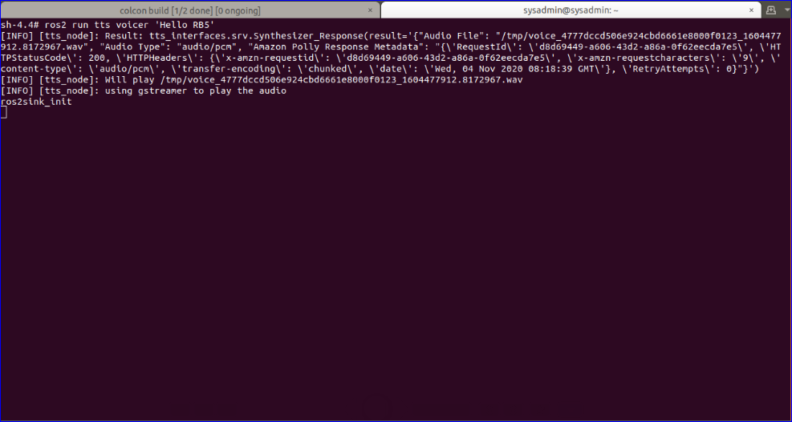

### Introduction

The tts ROS node sample application enables a robot to speak with a human voice by providing the Amazon Polly **Text-To-Speech service.**
The tts node requires an IAM User with the polly:SynthesizeSpeech permission policy.

#### Steps to create

1.	Setup AWS service permissions on AWS Dashboard
Add **“polly:SynthesizeSpeech”** permission to the IAM user

	i.  Select the IAM user created earlier, click Add permission, then tap Attach existing policies directly and then select the Create policy and paste the JSON snippet given below 

	```
	{
	  "Version": "2012-10-17",
	    "Statement": [
		{
		    "Effect": "Allow",
		    "Action": [
		        "polly:SynthesizeSpeech"
		    ],
		    "Resource": [
		        "*"
		    ]
		}
	    ]
	}
	```
      ii. Give name to policy, go to Review policy, select Create policy
      
      iii. Add the created policy to the IAM user by searching the policy name. Follow the steps below Go to **created user -> Add permission -> Attach existing policies directly -> search and select the created policy -> Next:review -> Add permission**
      
    Once the permission is set, open a terminal in Qualcomm Robotics RB5 and follow the steps below.

2.	Clone the tts-ros2 app

	i.  Create a ROS workspace and a source directory

	```
	mkdir -p ~/ros-workspace/src 
	cd ~/ros-workspace/src
	```

	ii. Clone the tts-ros2 app into the source directory, install dependencies

	```
	git clone https://github.com/aws-robotics/tts-ros2.git -b release-latest
	cd ~/ros-workspace 
	apt-get update && rosdep update
	rosdep install --from-paths src --ignore-src -r -y
	```

3.	Build the tts-ros2 app
	```
	source /opt/ros/dashing/setup.bash
	cd ~/ros-workspace && colcon build
	source ~/ros-workspace/install/local_setup.bash
	colcon test --packages-select tts && colcon test-result --all
	```

4.	Execute the tss-ros2 app

	i. Being in the same terminal and directory, enter the command 
	```
    ros2 launch tts tts.launch.py 
    ```
	ii. Open another terminal and send text request message 
	```
	source /opt/ros/dashing/setup.bash
	ros2 run tts voicer 'Hello RB5'
	```
	After executing these commands, an audio file is created in /tmp for the text we requested, the audio file looks like _"tmp/voice_a4584332ae81fb70bd8061dcfbee5f1b_1603201011.895409.wav"_

5.  Tts-ros2 application execution outputs
	
	Terminal 1: node launch 
	

	Terminal 2: Sending text request and audio file creation 
	

For more information on colcon bundle and bundle installation please read:
https://github.com/aws-robotics/tts-ros2


