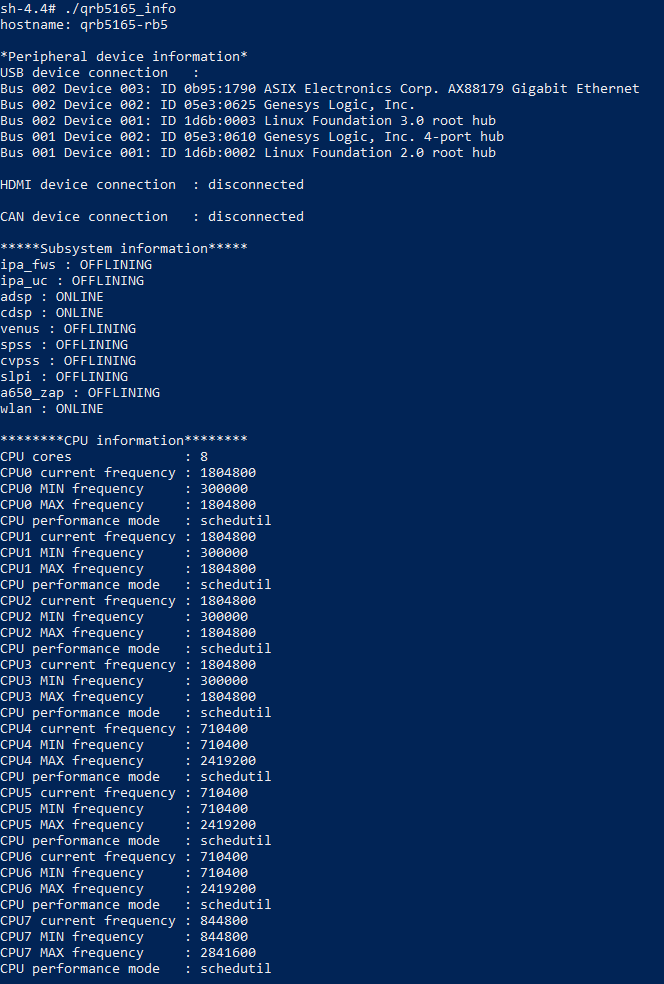
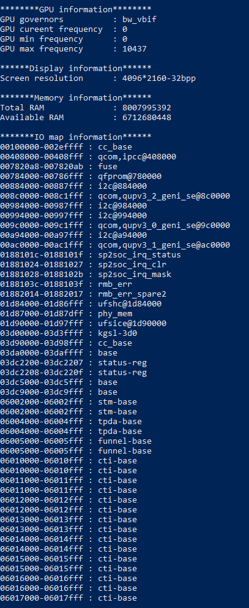

# RB5 Information User Guide

## 1. Init and set up the environment

###     1. Download source code to the devices

```shell
$ adb shell
$ cd /home
$ git clone https://github.com/quic/sample-apps-for-Qualcomm-Robotics-RB5-platform.git
```

###      2. Set up the environment

```shell
$ adb shell
$ apt-get install gcc
```

###      3. Build the program

```shell
$ adb shell
$ cd /home/Device-info
$ mkdir bin
$ cd src
$ make
```

## 2. Execute test routine

```shell
$ adb shell
$ cd /home/Device-info/bin
$ ./qrb5165_info
```

You can get the following information:

1. Scan what  peripheral device is connected. (usb/hdmi/can device)

2. Scan the status of subsystem through kernel node. offline or online.

3. CPU information:  Core number, Max/Min frequency for every core, current frequency. performance mode.

4. GPU information: gpu_governor, gpu_max_clock, gpu_clock, gpu_min_clock.

5. Display: resolution setting. 

6. Memory: Total memory size, memory map of subsystem, available HLOS memory size.

The snapshot after execution is shown below:






## 3. Code instructions

1. Get USB device via "lsusb" command

2. Check to if the HDMI device is connected through the node "/sys/class/drm/card0-DSI-1/status"

3. Check to if the HDMI device is connected through the node "/sys/class/net/can0/flags", determines if there is a RUNING flag

4. Get subsystem information: 

   Get the name from the node "/sys/bus/msm_subsys/devices/subsys*/name" ;

   Get the status from the node "/sys/bus/msm_subsys/devices/subsys*/state" ;

5. Get CPU core number through the node "/proc/cpuinfo"

6. Get CPU every core frequency from the node "/sys/devices/system/cpu/cpu*/cpufreq/"

7. Get GPU information from the node "/sys/devices/platform/soc/soc:qcom,gpubw/devfreq/soc:qcom,gpubw/"

8. Get display resolution from the function: int sysinfo(struct sysinfo *info);

9. Get memory map from the node "/proc/iomem"

## License
This is licensed under the BSD 3-Clause-Clear “New” or “Revised” License. Check out the [LICENSE](LICENSE) for more details.
