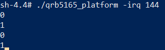
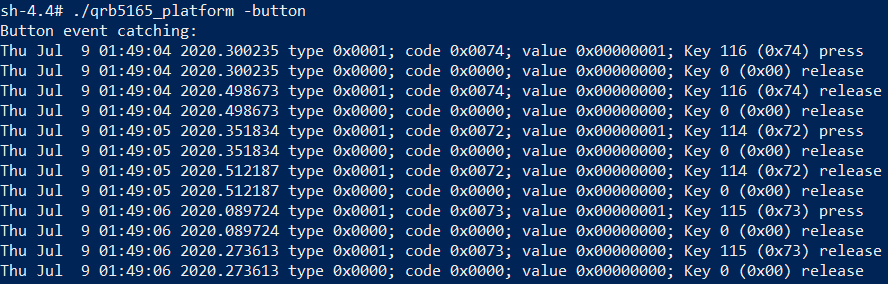
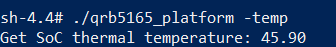

# RB5 platform User Guide

## 1. Init and set up the environment

   ###     1. Download source code to the devices

```shell
$ adb shell
$ cd /home
$ git clone https://github.com/quic/sample-apps-for-Qualcomm-Robotics-RB5-platform.git
```

   ###     2. Set up the environment

```shell
$ adb shell
$ apt-get install gcc
$ gcc --version
```

If you have access to GCC version information, then GCC installed successfully.

   ###     3. Build the program

```shell
$ adb shell
$ cd /home/RB5-Platform/src
$ make
```

## 2. Execution and description of test procedure

You can either compile or execute the test program directly in the folder /data/Platform/bin/

   ###     1. LED light controlling

```shell
$ adb shell
$ cd /home/RB5-Platform/bin
$ ./qrb5165_platform -led red 255
```

The second parameter could be red green or blue (But on the RB5 platform all three leds are red)

The third parameter could be 0-255 (0 is to turn off the LED, other values control brightness)

   ###     2. Simple GPIO input/output

```shell
$ adb shell
$ cd /home/RB5-Platform/bin
$ ./qrb5165_platform -gpio out 144 0
$ ./qrb5165_platform -gpio in 144
```

The second parameter could be out or in to control the GPIO input or output

The third parameter could be gpio number

The fourth parameter could be 1 or 0 to control the GPIO output (If GPIO is the input then there is no such parameter)

The value of the GPIO input or output is displayed in the console after execution.

   ###     3. Receive GPIO interrupt event

```shell
$ adb shell
$ cd /home/RB5-Platform/bin
$ ./qrb5165_platform -irq 144
```

The second parameter could be gpio number

The GPIO interrupt type is displayed in the console after execution

Press enter to exit the program

The snapshot after execution is shown below:



   ###     4. Button event catching

```shell
$ adb shell
$ cd /home/RB5-Platform/bin
$ ./qrb5165_platform -button
```
Then you can press any button to test it

The event of the key is displayed in the console after execution

Press enter to exit the program

The snapshot after execution is shown below:



   ###     5. Simple PWM output

```shell
$ adb shell
$ cd /home/RB5-Platform/bin
$ ./qrb5165_platform -pwm 1 1000 500
```

The second parameter could be 0 or 1 (RB5 platform only support 2 line gpio)

The third parameter could be period in ns

The fourth parameter could be high level time in ns, must be less than the period (The time ratio is the duty cycle)

   ###     6. Regulator setting

```shell
$ adb shell
$ cd /home/RB5-Platform/bin
$ ./qrb5165_platform -regulator bobc1-pm8150a_bob 1
```

The second parameter could be regulator name (such as: bobc1-pm8150a_bob, ldoa3-pm8150_l3......)

For example if the LDO node is:

/sys/kernel/debug/regulator/18200000.rsc:rpmh-regulator-bobc1-pm8150a_bob/

You can get regulator name is: bobc1-pm8150a_bob

The third parameter could be 0 or 1 (0 is disable the regulator, 1 is enable the regulator)

###     7. Read the SoC thermal temperature

```shell
$ adb shell
$ cd /home/RB5-Platform/bin
$ ./qrb5165_platform -temp
```

The SoC thermal temperature get from the node "/sys/class/thermal/thermal_zone0/temp"

The snapshot after execution is shown below:



## License
This is licensed under the BSD 3-Clause-Clear “New” or “Revised” License. Check out the [LICENSE](LICENSE) for more details.
