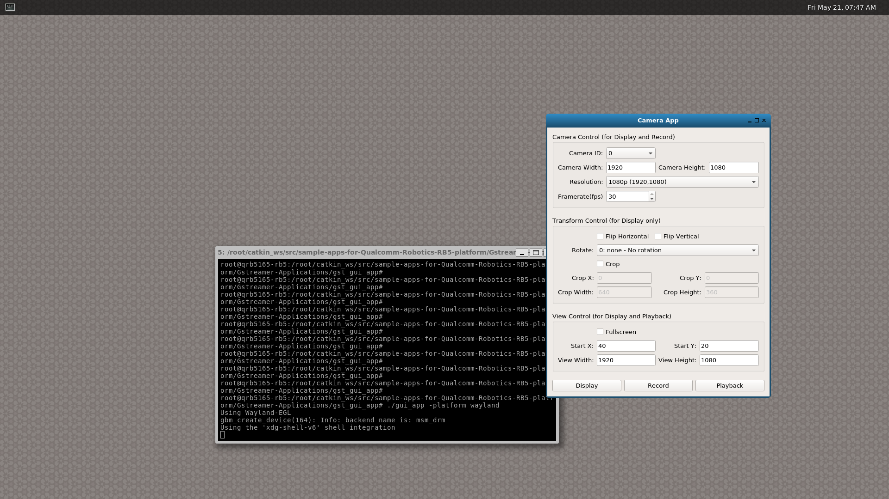

# Graphical User Interface Application

This sample shows a gui application which demonstrates camera display, camera recording, and mp4 playback. 


## Compile

To compile this sample independly, make sure Qt packages are installed.

```bash
apt install qt5-default qtwayland5 qtbase5-private-dev
```

```qmake``` must be run at the first time under the source directory.

```bash
$ qmake
```

After Makefile generated, use ```make``` to compile this sample.

```bash
$ make
```

## GUI Application

### Launch ```gui_app```

+ Connect the board to screen through HDMI output
+ Connect keyboard and mouse to the board
+ Login on the screen
+ Turn on weston display with ```weston.sh```
``` bash
$ /data/gstreamer-applications/weston.sh
```
+ Click left-top button on weston display to open weston-terminal
+ Run ```gui_app``` in weston-terminal with **specifying the platform to wayland**
  
```bash
$ cd /data/gstreamer-applications/gui_app
$ ./gui_app -platform wayland
```

### Alternative Way to Specity Platform

```
$ export QT_QPA_PLATFORM=wayland
$ ./gui_app
```

## Snapshot



## Settings

### Camera Settings

Camera settings set camera parameters for display and recording.

+ Camera ID (0~4)
+ Resolution: width and height
+ Framerate

### Transform Settings

Transform settings set transform parameters for display only.

+ Flip: horizontal or vertical
+ Rotate: 90CW, 90CCW, and 180
+ Crop: x, y, width, height

### View Settings

View settings set view parameters for display and playback.

+ Fullscreen
+ Location: x, y
+ Size: width and height


## Operations

There are 3 operations in this application.

### Display

+ Click ```Display``` button. Camera view will display on the screen.

+ Click ```Stop``` to stop display.

### Record

+ Click ```Record``` button. A file dialog will popup to specify the mp4 file name to be saved. Then recording will start. The camera view will also display on the screen.

+ Click ```Stop``` to stop recording.

### Playback

+ Click ```Playback``` button. A file dialog will popup to specify the mp4 file name to playback. Then playback will start. 

+ Click ```Stop``` to stop playback.

## License
This is licensed under the BSD 3-Clause-Clear “New” or “Revised” License. Check out the [LICENSE](../LICENSE) for more details.
