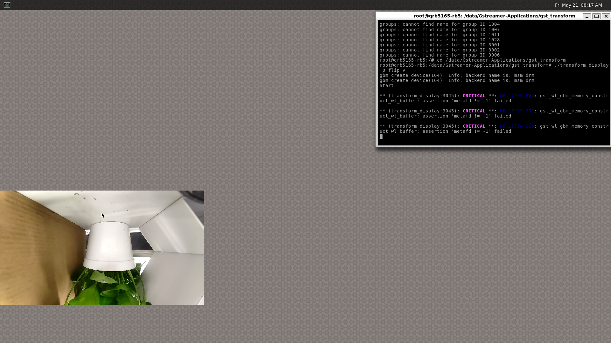
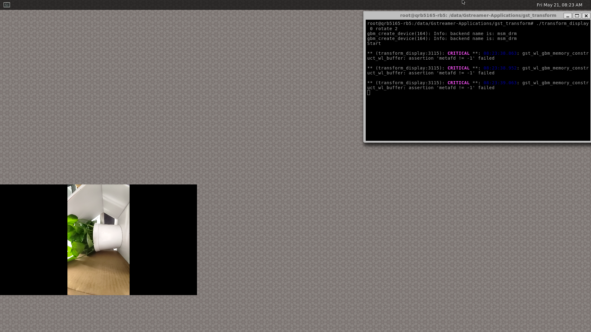
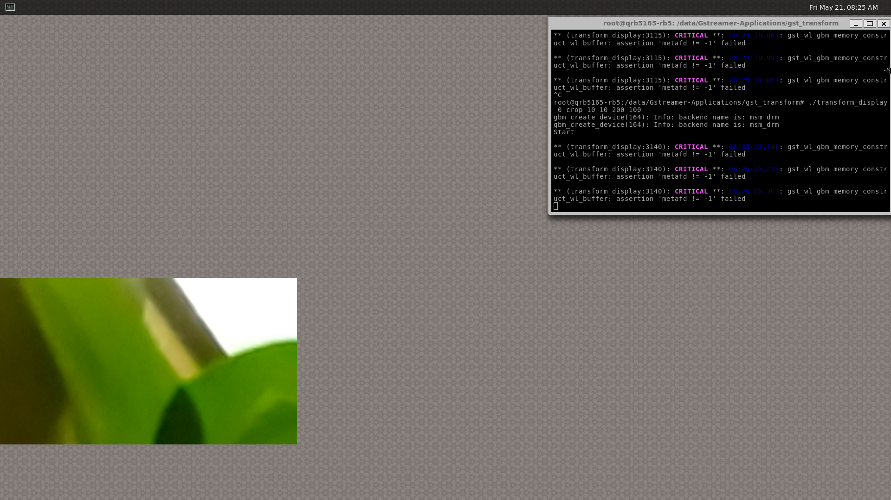

# Video Transform

This sample shows how to transform ISP camera video to weston display.

## Run Sample

```transform_video``` transforms ISP camera video to weston display.

Usage: transform_display [camera id: 0|1|2|3] [Operation]

Operation:

    flip v|h (v:vertical, h:horizontal)
    rotate 1|2|3  (1:90CW, 2:90CCW, 3:180)
    crop x y width height

Apply one operation at a time.

### Start Transform Display:

+ Connect the board to screen through HDMI output
+ Connect keyboard and mouse to the board
+ Login on the screen
+ Turn on weston display with ```weston.sh```
``` bash
$  /data/sample-apps-for-Qualcomm-Robotics-RB5-platform/Gstreamer-Applications/weston.sh
```
+ Click left-top button on weston display to open weston-terminal
+ Run ```transform_display``` in weston-terminal to transform camera video

Example to transform video from camera 0:
``` bash
$cd /data/sample-apps-for-Qualcomm-Robotics-RB5-platform/Gstreamer-Applications/gst_transform
$ ./transform_display 0 flip v
$ ./transform_display 0 flip h
$ ./transform_display 0 rotate 2
$ ./transform_display 0 crop 10 10 200 100
```

The output screenshots of examples in the follow:





### Stop Transform Display:

+ Move mouse to weston-terminal and click it to activate it
+ Press Ctrl-C to stop display

## License
This is licensed under the BSD 3-Clause-Clear “New” or “Revised” License. Check out the [LICENSE](../LICENSE) for more details.
