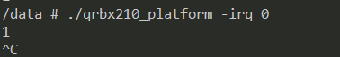
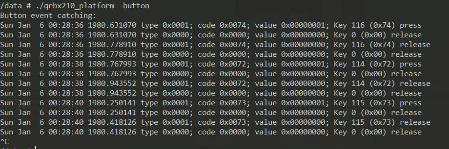
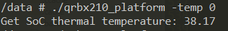

# RB1/2 platform User Guide

### 1. Set up the environment
Install RB1/2 LE SDK and source the environment
Download sample code to PC

### 2. Compile
```
$ cd GPIO-samples
$ mkdir -p bin
$ cd src
$ make
```

### 3. Push binary to device
```
$ cd ../bin
$ adb push qrbx210_platform /data
```

## 2. Execution and description of test procedure

You can either compile or execute the test program directly in the folder /data/Platform/bin/

   ###     1. LED light controlling

```shell
$ adb disable-verity
$ adb reboot
$ adb wait-for-device root
### The above three steps only need to be operated once and will always be valid.

adb shell
cd /data/
./qrbx210_platform -led user-led0_green 255
```

The second parameter could be red green or blue (But on the RB2 platform all three leds are green, RB1 not supports led function)

RB2:The second parameter allows you to choose one of the four options. (user-led0-green user-led1-green user-led2-green user-led3-green)

RB1:The second parameter allows you to choose one of the three options. (user-led0-green user-led1-green user-led2-green)

The third parameter could be 0-255 (0 is to turn off the LED, other values control brightness)

   ###     2. Simple GPIO input/output

```shell
adb shell
cd /sys/class/gpio
echo 400 > export
cd /data
./qrbx210_platform -gpio out 1 0
./qrbx210_platform -gpio in 1
```

This feature only supports RB2.

The second parameter could be out or in to control the GPIO input or output

The third parameter could be gpio number.The GPIO offset is 399. 400=offset+1.(GPIO port range:399-511)

If you want to apply to RB1: Modify the macro GPIO_CHIP to a value of 385 in qrbx210_platform.c .(GPIO port range:385-511)

The fourth parameter could be 1 or 0 to control the GPIO output (If GPIO is the input then there is no such parameter)

The value of the GPIO input or output is displayed in the console after execution.

   ###     3. Receive GPIO interrupt event

```shell
adb shell
cd /data
./qrbx210_platform -irq 100
```

The second parameter could be gpio number

The GPIO interrupt type is displayed in the console after execution

Press enter to exit the program

The snapshot after execution is shown below:



   ###     4. Button event catching

```shell
adb shell
cd /data
./qrbx210_platform -button
```
Then you can press any button(on/off vol+ vol-) to test it

The event of the key is displayed in the console after execution

Press enter to exit the program

The snapshot after execution is shown below:



   ###     5. Simple PWM output

```shell
adb shell
cd /data
./qrbx210_platform -pwm 0 1000 500
```

The second parameter could be 0 or 1 (RB1/2 platform only support 1 line gpio)

The third parameter could be period in ns

The fourth parameter could be high level time in ns, must be less than the period (The time ratio is the duty cycle)


###     6. Read the SoC thermal temperature

```shell
adb shell
cd /data
./qrbx210_platform -temp 0
```

The second parameter could be thermal_zone number

The SoC thermal temperature get from the node "/sys/class/thermal/thermal_zone%d/temp"

The snapshot after execution is shown below:



## License
This is licensed under the BSD 3-Clause-Clear “New” or “Revised” License. Check out the [LICENSE](LICENSE) for more details.
