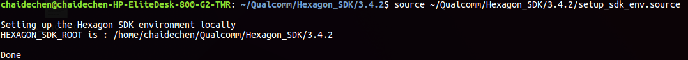
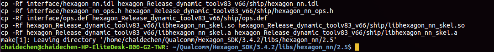
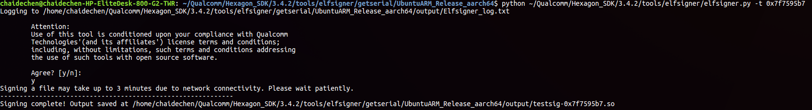
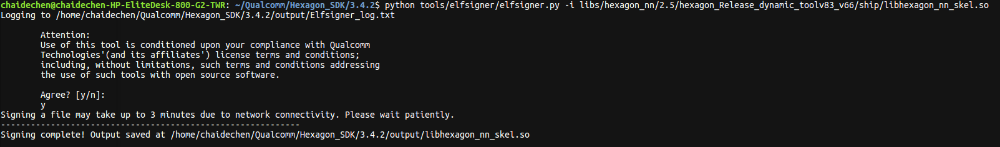
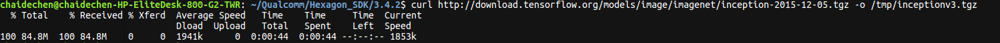
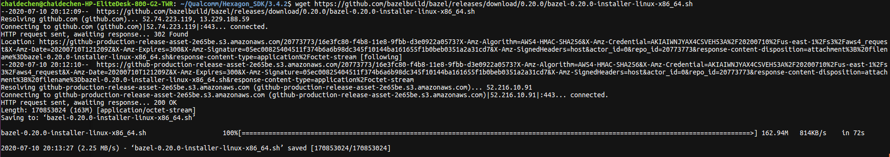
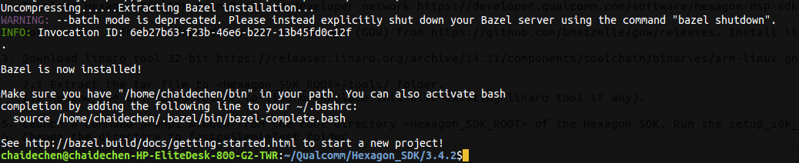
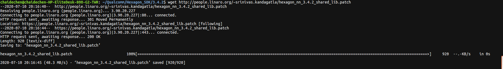
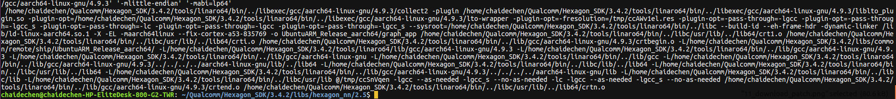
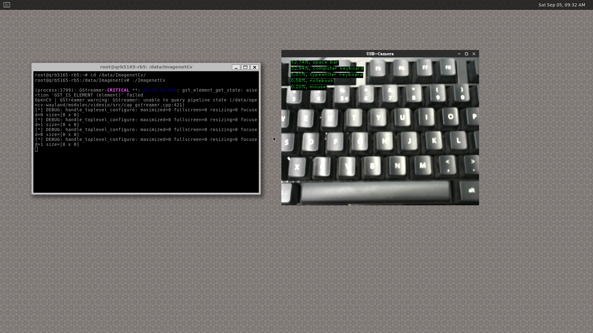

# Inception V3 on Qualcomm Robotics RB5 DSP

This project is designed to show how you can use the Qualcomm® Robotics RB5 development kit, specifically using the Qualcomm® Hexagon™ DSP with Hexagon Vector extensions (HVX), coupled with Hexagon DSP SDK to achieve high speed and high performance on device Machine Learning.

## Getting Started guide

### Step 1: Setting up the Host Linux Machine

Build Hexagon NN DSP library for the Qualcomm Robotics RB5 CDSP

- Download the Hexagon SDK version 3.4.2 for Linux from here.

- https://developer.qualcomm.com/software/hexagon-dsp-sdk

- Unzip the file and install the SDK using the following commands

  ```
  $ cd qualcomm_hexagon_sdk_3_4_2_linux/
  $ chmod +x qualcomm_hexagon_sdk_3_4_2_eval.bin
  $ ./qualcomm_hexagon_sdk_3_4_2_eval.bin
  ```

- Set the environment variable $HEXAGON_SDK_ROOT by the command

  ```
  $ source ~/Qualcomm/Hexagon_SDK/3.4.2/setup_sdk_env.source
  ```
 

- Compile Hexagon NN using the following commands and generate a hexagon library

  ```
  $ cd $HEXAGON_SDK_ROOT/libs/hexagon_nn/2.5/
  $ make tree VERBOSE=1 CDSP_FLAG=1 V=hexagon_Release_dynamic_toolv83_v66 V66=1
  ```


The libhexagon_nn_skel.so generated here is the shared library for the CDSP

### Step 2: Generate Testsig and sign the previously generated shared library-libhexagon_nn_skel.so with it.

- To generate a Testsig, the serial number of Target robotics development kit is needed.

- Get serial number from the robotics development kit ’s console using command.

  ```
  $ cd $HEXAGON_SDK_ROOT/tools/elfsigner/getserial/UbuntuARM_Release_aarch64
  $ adb push getserial /
  $ adb shell chmod 777 getserial
  $ adb shell
  # ./getserial
  ```
  The above command returns the serial number of the attached device:

  ```
  ####################Serial number (see below)###########################
  
  Serial Num : 0x7f7595b7
  
  ####################Serial number (see above)###########################
  ```

  

- Pass the serial_number to elfsigner.py using the following commands:

  ```
  $ python <Hexagon SDK Dir>/tools/elfsigner/elfsigner.py -t 0x<serial number>
  ```


- Sign the shared library libhexagon_nn_skel.so using elfsigner.py

  ```
  $ cd $HEXAGON_SDK_ROOT
  $ python tools/elfsigner/elfsigner.py -i libs/hexagon_nn/2.5/hexagon_Release_dynamic_toolv83_v66/ship/libhexagon_nn_skel.so
  ```


### Step 3: Generate Inception v3 model graph for Hexagon DSP.

In this project, you will use an Inception v3 model’s frozen graph for the image classification. In the following steps, download TensorFlow, Bazel and generate a Hexagon DSP compatible version of the Inception V3 frozen graph.

- Download TensorFlow Inception V3 model Frozen graph using

  ```
  $ curl http://download.tensorflow.org/models/image/imagenet/inception-2015-12-05.tgz -o /tmp/inceptionv3.tgz
  ```


  and unzip it to /tmp directory.

  ```
  $ tar -xzf /tmp/inceptionv3.tgz -C /tmp/
  ```

Download and install Bazel (version 0.20.0) using the following commands:

```
$ wget https://github.com/bazelbuild/bazel/releases/download/0.20.0/bazel-0.20.0-installer-linux-x86_64.sh
$ chmod +x bazel-0.20.0-installer-linux-x86_64.sh
$ ./bazel-0.20.0-installer-linux-x86_64.sh --user
```



Download and build TensorFlow(version 1.13.2) using the following commands

```
$ wget https://github.com/tensorflow/tensorflow/archive/v1.13.2.tar.gz
$ tar -zxvf v1.13.2.tar.gz
$ cd tensorflow-1.13.2
$ ./configure
```

Build transform_graph tool in TensorFlow using the following commands

```
$ touch WORKSPACE
$ bazel build tensorflow/tools/graph_transforms:transform_graph
```

Quantize protobuf using Graph Transform Tool

```
$ bazel-bin/tensorflow/tools/graph_transforms/transform_graph --in_graph=/tmp/classify_image_graph_def.pb --out_graph=/tmp/inception_v3_quantized.pb --inputs="Mul" --outputs='softmax' --transforms='add_default_attributes strip_unused_nodes(type=float, shape="1,299,299,3") remove_nodes(op=Identity, op=CheckNumerics) fold_constants(ignore_errors=true) fold_batch_norms fold_old_batch_norms quantize_weights quantize_nodes fold_constants strip_unused_nodes sort_by_execution_order'
```

Convert the quantized protobuf into a C file (iv3.c) using the following commands

```
$ cd $HEXAGON_SDK_ROOT/examples/hexagon_nn/
$ sudo apt install virtualenv
$ virtualenv -p python2 env2
```

If this gives an error “virtualenv not found”/ “pip missing”, install pip using

```
$ sudo apt install python-pip
$ sudo apt install python-numpy
```

and install virtualenv using

```
$ sudo apt-get install python-virtualenv
$ source env2/bin/activate
$ pip install --upgrade 'setuptools<45.0.0'
$ pip install -r environments/req2.txt
```

Enter the command below to generate Hexagon compatible iv3.c file，

```
$ python ${HEXAGON_SDK_ROOT}/examples/hexagon_nn/scripts/tensorflow_to_hexagon_nn.py /tmp/inception_v3_quantized.pb ${HEXAGON_SDK_ROOT/examples/hexagon_nn/tutorials/007-tensorflow-to-hexagon-nn/inceptionv3_v1.yaml > iv3.c
```

And copy iv3.c to the folder as shown in the command

```
$ cp iv3.c ${HEXAGON_SDK_ROOT}/libs/hexagon_nn/2.5/
```

### Step 4: Download linaro64

Please download gcc-linaro-4.9-2014.11-x86_64_aarch64-linux-gnu.tar.xz from http://releases.linaro.org/archive/14.11/components/toolchain/binaries/aarch64-linux-gnu

Extract the tar file and copy folder gcc-linaro-4.9-2014.11-x86_64_aarch64-linux-gnu to <Hexagon_SDK_ROOT>/tools/ folder.

Rename gcc-linaro-4.9-2014.11-x86_64_aarch64-linux-gnu folder to linaro64 

### Step 5: Compile hexagon-nn shared user space library

```
$ cd $HEXAGON_SDK_ROOT/libs/hexagon_nn/2.5/
```

- Download the patch using

  ```
  $ wget http://people.linaro.org/~srinivas.kandagatla/hexagon_nn_3.4.2_shared_lib.patch
  ```


- Patch Hexagon NN with the downloaded patch to compile as shared library for user space

  ```
  $ patch -p1 < hexagon_nn_3.4.2_shared_lib.patch
  $ make tree V=UbuntuARM_Release_aarch64 CDSP_FLAG=1 V66=1 GRAPHINIT="iv3.c"
  ```


### Step 6: Push generated files to target and run it

```
$ adb push ~/Qualcomm/Hexagon_SDK/3.4.2/libs/hexagon_nn/2.5/UbuntuARM_Release_aarch64/graph_app /data/
$ adb push ~/Qualcomm/Hexagon_SDK/3.4.2/libs/hexagon_nn/2.5/UbuntuARM_Release_aarch64/libhexagon_nn.so /usr/lib
$ adb push ~/Qualcomm/Hexagon_SDK/3.4.2/libs/hexagon_nn/2.5/hexagon_Release_dynamic_toolv83_v66/libhexagon_nn_skel.so /usr/lib/rfsa/adsp/
$ adb push ~/Qualcomm/Hexagon_SDK/3.4.2/libs/hexagon_nn/2.5/test/panda_299x299.dat /data/
$ adb shell chmod a+x /data/graph_app
$ adb shell /data/graph_app --input_to_float 1 --iters 20 /data/panda_299x299.dat
```

You should expect output like the following:

```
$ Run!
$ output size=4032
$ Rank,Softmax,index,string
$ 0,0.940308,169,giant panda
$ 1,0.002943,7,lesser panda
$ 2,0.000613,61,brown bear
$ 3,0.000534,878,earthstar
$ 4,0.000424,374,lawn mower
$ AppReported: 41682408
```

### Part 2 - On the Qualcomm Robotics RB5 Development Kit (Target)

### Step 1: Make hardware connections and power up Robotics Development Kit

- Connect Robotics Development Kit with USB Camera and wireless USB for Keyboard and mouse.
- Connect Robotics Development Kit with HDMI cable and the other end of the cable to the HDMI Screen/monitor that is powered on.
- Connect the power cable to Robotics Development Kit and wait for the desktop to pop up.

### Step 2: Start cdsprpcd daemon

```
$ adb shell
$ cdsprpcd&
```

### Step 3: Build OpenCV for Wayland

The Qualcomm Robotics RB5 development board supports Wayland/Weston as the display server, this OpenCV is a special version for Wayland compiled on the development board.

```
root@qrb5165-rb5:/# apt-get install build-essential curl unzip
root@qrb5165-rb5:/# apt-get install cmake git libgtk2.0-dev pkg-config libavcodec-dev libavformat-dev libswscale-dev
root@qrb5165-rb5:/# apt-get install libjpeg-dev libpng-dev
root@qrb5165-rb5:/# apt-get install python-numpy libxkbcommon-dev libwayland-client0 libwayland-dev
root@qrb5165-rb5:/# cd /data
root@qrb5165-rb5:/# git clone https://github.com/pfpacket/opencv-wayland.git
root@qrb5165-rb5:/# cd opencv-wayland/
root@qrb5165-rb5:/# mkdir build
root@qrb5165-rb5:/# cd build
root@qrb5165-rb5:/# cmake -D CMAKE_BUILD_TYPE=Debug -D CMAKE_INSTALL_PREFIX=/usr/local -DWITH_IPP=OFF -DWITH_WAYLAND=ON -DWITH_GTK=OFF ..
root@qrb5165-rb5:/# make -j8
```

### Step 4: Run Weston desktop on Qualcomm Robotics RB5 Development kit

If the HDMI cable connects properly, after the device boot up, you will see the device boot up logs and then see a shell is ready for command input. Run the following command to launch Weston desktop.

```
root@qrb5165-rb5:/# Weston --connector=29
```

If it fails to run, you can try the following commands with adb on an Ubuntu PC. Please make sure the Qualcomm Robotics RB5 development kit is connected to the Ubuntu PC with a USB cable. Please ignore this step if the above command runs successfully.

```
root@qrb5165-rb5:/# mkdir -p /usr/bin/weston_socket
root@qrb5165-rb5:/# chmod 700 /usr/bin/weston_socket
root@qrb5165-rb5:/# export XDG_RUNTIME_DIR=/usr/bin/weston_socket
root@qrb5165-rb5:/# export LD_LIBRARY_PATH=/usr/lib:/usr/lib/aarch64-linux-gnu/
root@qrb5165-rb5:/# weston --tty=1 --connector=29 --backend=drm-backend.so
```

### Step 5: Run OpenCV ImageNet application for camera

- Download the application from the camera branch and build using the following commands

```
root@qrb5165-rb5:/# git clone https://git.linaro.org/people/srinivas.kandagatla/ImagenetCv.git
root@qrb5165-rb5:/# cd ImagenetCv
root@qrb5165-rb5:/# git branch -a
root@qrb5165-rb5:/# git checkout camera
```

Build application using

```
root@qrb5165-rb5:/# cmake .
root@qrb5165-rb5:/# make
```

Run the application using the command

```
root@qrb5165-rb5:/# ./ImagenetCv
```

If this shows an error like “install libgtk2.0-dev”

Install libgtk2.0-dev using the commands given below and run the application

```
root@qrb5165-rb5:/# apt get update
root@qrb5165-rb5:/# apt get upgrade
root@qrb5165-rb5:/# apt get install libgtk2.0-dev
```

Running the application pops up a window that shows video captured by the camera and the image classification being done


## License
This is licensed under the BSD 3-Clause-Clear “New” or “Revised” License. Check out the [LICENSE](LICENSE) for more details.
