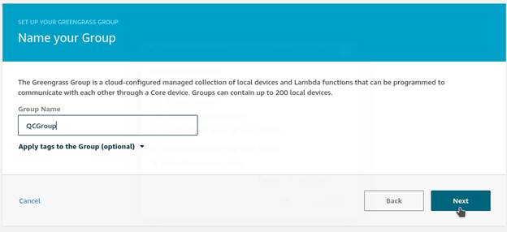

### Installation of AWS Greengrass on Qualcomm Robotics RB5:
Once you bring up the Qualcomm Robotics RB5 following the steps from here (https://developer.qualcomm.com/qualcomm-robotics-rb5-kit/quick-start-guide/qualcomm_robotics_rb5_development_kit_bring_up/run-a-basic-ROS2-application), follow the steps below to install AWS Greengrass
Enable symlink and hardlink protection 
1) In the terminal(Putty or adb shell), enter the following commands to create sysctl configuration file with the options to enable the protection. 
```
 $ sudo sh -c 'echo "fs.protected_hardlinks = 1" >> /etc/sysctl.d/local-ggc.conf' 
 $ sudo sh -c 'echo "fs.protected_symlinks = 1" >> /etc/sysctl.d/local-ggc.conf'
```
2) Verify the protection is working by checking with the command:
```
$ cat /proc/sys/fs/protected_{hardlinks,symlinks} 
```
3) Use the following commands to add a user for greengrass.
```
$ adduser --system ggc_user 
$ addgroup --system ggc_group 
```
4) Install sqlite3 using the following commands, 
```
$ apt-get update 
$ apt-get install sqlite3 
```


5) Install cmake using the following command
```
 $ apt-get install cmake
```
 

### Install AWS CLI on Qualcomm Robotics RB5

1) In the terminal, check the python installation by $ python –version, if python is not installed, use following commands to install
```
$ apt-get update && apt-get install python
```
2) Download the AWS CLI Bundled installer using below command,
```
$ curl "https://s3.amazonaws.com/aws-cli/awscli-bundle.zip" -o "awscli-bundle.zip"
```
Unzip the package, using $ unzip awscli-bundle.zip

3) Run the install executable,
```
$ sudo ./awscli-bundle/install -i /usr/local/aws -b /usr/local/bin/aws
```


[Alt tag: “Install AWS CLI”]

### Create AWS Greengrass Group and AWS Greengrass Core: (On an Ubuntu/Windows PC)

Assuming you have an AWS account,

1)  Sign in to the AWS Management console

2)  In the console, search for IoT Greengrass


[Alt tag: ”Search for GG in AWS console”]

3) On the AWS Greengrass page, choose Get Started and Manage your groups

 


[Alt tag: “Get started with groups”]

Create a Greengrass Group:

1) On the Greengrassgroup page , click on Create Group


[Alt tag: ”Create a GG group”]

2) On the “Set up your Greengrass group” page, choose Use default creation


[Alt tag: “Create a default GG group”] 

3) Type a name for your group, and then choose Next.



[Alt tag: “Name GG group”]

4) Use the default name for your AWS Greengrass core, and then choose Next.


[Alt tag: “Name GG group”]

5) Choose Create Group and Core.


[Alt tag: “Create GG group and core”]

6) Click the link to download the tar file consisting private key, public key, and certificate for your AWS Greengrass core.


[Alt tag: “Download Keys and certificate”]

7)      Click on Choose your platform. In the next page, Download Greengrass software package for Armv8( AArch64) architecture and Arch Linux Distribution. When the download is complete, choose Finish.


[Alt tag: “Choose Platform- Armv8-Arch Linux”]

8) Move the downloaded AWS Greengrass software and certificates onto Qualcomm robotics RB5 using adb push command

9) In the terminal of Ubuntu PC, enter the commands –
```
$ adb push ‘PATH_TO_DOWNLOADS/greengrass-linux-aarch64-1.11.0.tar.gz’ ‘DIR_PATH_ON_RB5’
$ adb push ‘PATH_TO_DOWNLOADS/25f8d69a39-setup.tar.gz ‘DIR_PATH_ON_RB5’
```


### Install AWS Greengrass Certificates on Qualcomm Robotics RB5

1) On Qualcomm Robotics RB5 , download the AWS IoT root CA certificate from the Verisign Class 3 Public Primary G5 root CA certificate link in AWS IoT Documentation. Or enter the following command in the terminal,
```
$ wget https://www.websecurity.digicert.com/content/dam/websitesecurity/digitalassets/desktop/pdfs/roots/VeriSign-Class%203-Public-Primary-Certification-Authority-G5.pem
```


2) Move the downloaded file to /greengrass/certs directory and rename it as root-ca.pem using the command
```
$ mv ‘VeriSign-Class 3-Public-Primary-Certification-Authority-G5.pem’ ‘PATH_TO_GREENGRASS’/certs/root-ca.pem
```
3) Also copy the AWS Greengrass core's private key and certificate into the /greengrass/certs directory. Use the following names while copying the files


[Alt tag: “Rename key and certificate”]

Use the following commands to copy files to /greengrass/certs directory
```
$ mv 25f8d69a39.cert.pem ‘PATH_TO_GREENGRASS’/certs/cloud.pem.crt
$ mv 25f8d69a39.private.pem ‘PATH_TO_GREENGRASS’/certs/cloud.pem.key
```


### Configure your Greengrass core:

You need to associate your AWS Greengrass core(Qualcomm Robotics RB5) with the AWS IoT thing you created for it. You do that by using the thing's ARN, the unique identifier assigned in the cloud to your AWS Greengrass core device when you provisioned it.

1. Find the thing ARN for your AWS Greengrass core. In the AWS Greengrass console, from the navigation page, choose Groups.


[Alt tag: “Greengrass Groups ”]

2. Choose your group to display its detail page.


[Alt tag: ”Choose your group”]

3. In the navigation pane, choose Cores and choose your AWS Greengrass core to display its detail page.


[Alt tag: “Choose your core”]

4. Copy the ARN of your AWS Greengrass core.


[Alt tag: “Thing ARN ”]

5. On your AWS Greengrass core device(Ubuntu container), open terminal and do the following,
```
$ vim /greengrass/config/config.json
```
Change the contents of config.json which initially look like below


[Alt tag : “default config.json ”]

The updated config.json should look like below:


[Alt tag : “updated config.json ”]

The table here describes the attributes used for updating config.json file


[Alt tag: “Attributes and descriptions”]

6. Start your AWS Greengrass Core to connect to the Cloud, with the commands below
```
$ cd /home/greengrass/ggc/core
$ ./greengrassd start
```

If the Greengrass daemon started successfully, you should see the following output


[Alt tag: “Start Greengrass”]

