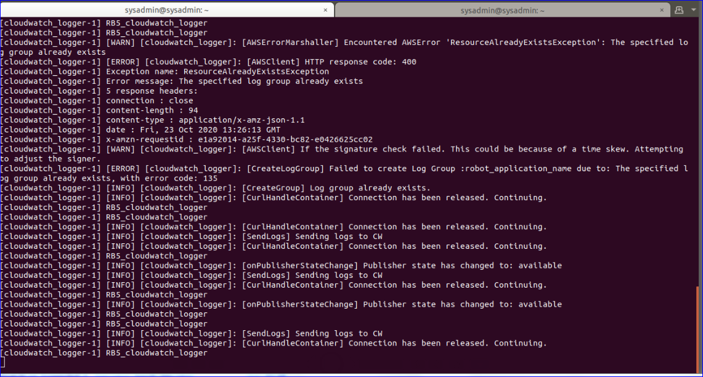
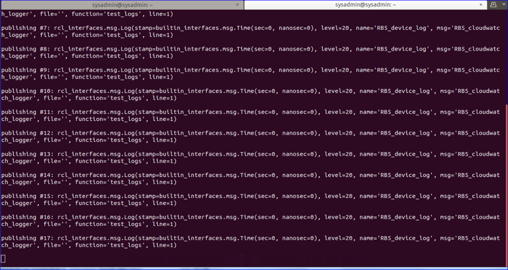
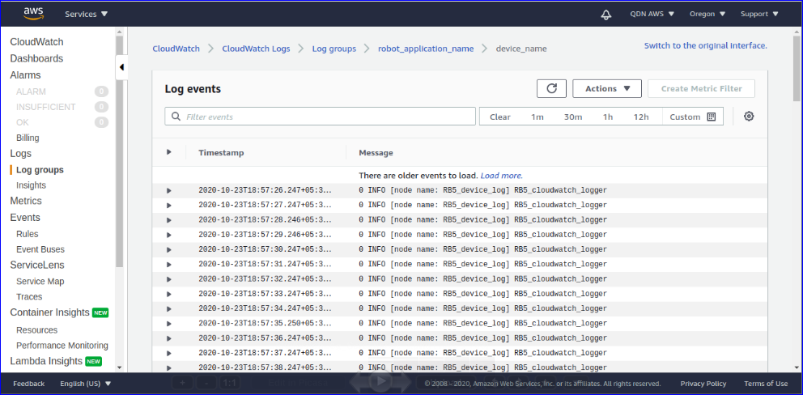

### Introduction
The cloudwatch_logger node enables logs generated in a ROS system to get sent to AWS CloudWatch Logs
The CloudwatchLogs-ros2 node requires an IAM user with the 4 permissions listed below.
1. Add the following permissions to IAM user

    i) Select the IAM user created earlier, click Add permission, then tap Attach existing policies directly and then select the Create policy and paste the JSON snippet given below 
    ```
    {
        "Version": "2012-10-17",
        "Statement": [
            {
                "Effect": "Allow",
                "Action": [
                    "logs:PutLogEvents",
                    "logs:DescribeLogStreams",
                    "logs:CreateLogStream",
                    "logs:CreateLogGroup"
                ],
                "Resource": [
                    "*"
                ]
            }
        ]
    }
    ```

    ii. Give name to policy, go to _Review policy_, select _Create policy_.
    
    iii) Add the created policy to the IAM user by searching the policy name. Follow the steps below
    Go to created user -> **Add permission -> Attach existing policies directly -> search and select the created policy -> Next:review -> Add permission**

2. Clone the CloudwatchLogs-ros2 app

    i.Create a ROS workspace and a source directory
    ```
    mkdir -p ~/ros-workspace/src 
    cd ~/ros-workspace/src
    ```
    ii. Clone the CloudwatchLogs-ros2 app into the source directory, install dependencies
    ```
    git clone https://github.com/aws-robotics/cloudwatchlogs-ros2.git -b release-latest
    cd ~/ros-workspace 
    apt-get update && rosdep update
    rosdep install --from-paths src --ignore-src -r -y
    ```
3. Build the CloudwatchLogs-ros2 app
    ```
    source  /opt/ros/dashing/setup.bash
    cd ~/ros-workspace && colcon build
    source ~/ros-workspace/install/local_setup.bash
    colcon test && colcon test-result --all
    export HOME=/root
    ```
4. Execute the CloudwatchLogs-ros2 app

    i. In the same terminal and directory, execute following command:
    ```
    ros2 launch cloudwatch_logger cloudwatch_logger.launch.py
    ```
    ii. Open another terminal and send test log message 
    ```
    source  /opt/ros/dashing/setup.bash
    ros2 topic pub rosout rcl_interfaces/msg/Log '{level: 20, name: RB5_device_log, msg:RB5_cloudwatch_logger, function: test_logs, line: 1}'
    ```
    
    After executing these commands login to AWS Cloudwatch log Dashboard-to check the logs.
    
    https://us-west-2.console.aws.amazon.com/cloudwatch/home?region=us-west-2#logsV2:log-groups/log-group/robot_application_name  
    
    **Note** : In the launch file- cloudwatch_logger.launch.py , the name of the log group should be robot_application_name and the log stream should be device name and region as us-west-2
    
    For more information regarding this please refer Launch File section in below link https://github.com/aws-robotics/cloudwatchlogs-ros2/blob/master/README.md
    
5. CloudwatchLogs-ros2  application execution outputs


    
    [Alt tag: ”node launch”]
    
    
    [Alt tag: ”Sending test log messages”]
    
    
    [Alt tag: ”AWS Cloudwatch log Dashboard under robot_application_name”]

For more information regarding this please refer below link:
https://github.com/aws-robotics/cloudwatchlogs-ros2/


