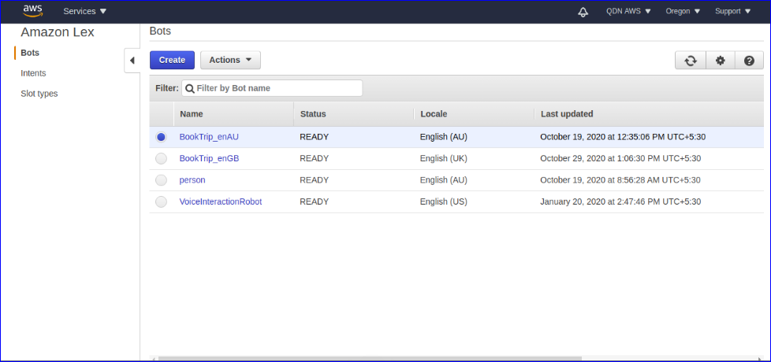
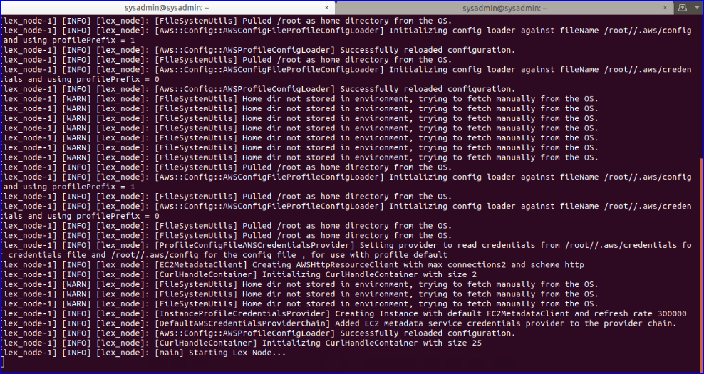
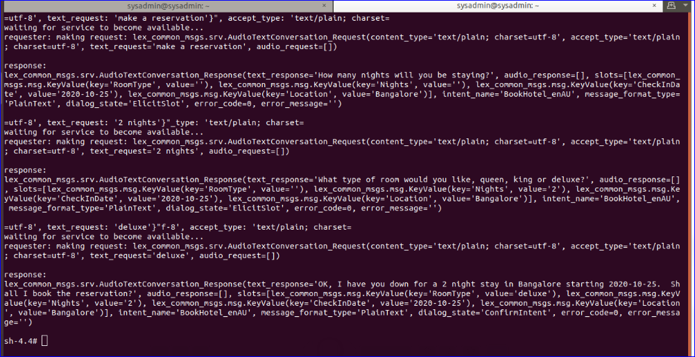

### Introduction
The ROS lex_node node enables a robot to comprehend natural language commands by voice or textual input and respond through a set of actions, which an AWS Lex Bot maps to ROS messages. The lex-ros2 is a sample application to integrateAmazon Lex (aka alexa), natural language processing service. 
  
Once wake-word engine and TTS(Text-to-Speech) are attached to both ends of this sample application, a robot can be turned into a powerful gadget that can accept and execute tasks based on voice commands in natural language.

The lex node requires an IAM User with the **AmazonLexRunBotsOnly** permission policy.  

 1. Add “AmazonLexRunBotsOnly” permission to the IAM user

    i. Select the IAM user created earlier, click Add permission, then tap Attach existing policies directly, search for AmazonLexRunBotsOnly policy, select policy and add. 

 2. Clone the lex-ros2 app

    i. Create a ROS workspace and a source directory
    ```
    mkdir -p ~/ros-workspace/src 
    cd ~/ros-workspace/src
    ```
    ii. Clone the lex-ros2 app into the source directory, install dependencies
    ```
    git clone https://github.com/aws-robotics/lex-ros2.git -b release-latest
    cd ~/ros-workspace 
    apt-get update && rosdep update
    rosdep install --from-paths src --ignore-src -r -y
    ```
3.   Build the lex-ros2 app

       i.  Create the Amazon lex bot in AWS Web console
       
        a. Create sample bot: BookTripModify the configuration file in the cloned lex-ros2 app
       - Go to https://us-west-2.console.aws.amazon.com/lex/home?region=us-west-2
       - select the region as US West (Oregon)us-west-2 on top right corner and click on “Get Started”
        - Under “Try a sample”, select BookTrip,  give Bot name as BookTrip, choose language as English(AU) and keep other information as default.
        - Then click the Create button, to create BookTrip_enAU bot
        
       b. Create a new alias for the bot and publish
        Select the Bot you created (BookTrip_enAU) on the top right corner, click on Publish and it will ask to select the alias to be published,  select Create new alias, give a name to alias as  ‘botbook’ and click Publish.
        
        
        [Alt tag: ”AWS lex console”]
        
     ii.  Modify the configuration file in the cloned lex-ros2 app
      - Modify config/sample_configuration.yaml to reflect the new bot and alias created in the previous step.
        ```
        cd ~/ros-workspace/src/lex-ros2/lex_node/config/
        vim sample_configuration.yaml
        ```
        Change the following 3 parameters in the sample_configuration.yaml and save  
        ##### lex_configuration:

        ```
          # Unique per robot, signifies "who" is communicating with lex
          user_id: "lex_node"
          # The Lex Bot Name as seen on the lex console
          bot_name: "BookTrip_enAU"
          # The Lex Bot Alias as published
          bot_alias: "botbook"
          region: "us-west-2"
         ``` 
      iii.  Build the lex-ros2 app
      
        ```
        source  /opt/ros/dashing/setup.bash
        cd  ~/ros-workspace && colcon build
        source  ~/ros-workspace/install/local_setup.bash
        colcon test --packages-select lex_node && colcon test-result –all
        ```

4. Execute the lex-ros2 app

    i.Being in the same terminal and directory, enter the command
    ```
    ros2 launch lex_node lex.launch.py
    ```
    ii.Open another terminal and send text request message
    ```
    source  /opt/ros/dashing/setup.bash
    ros2 service call /lex_conversation lex_common_msgs/AudioTextConversation "{content_type: 'text/plain; charset=utf-8', accept_type: 'text/plain; charset=utf-8', text_request: 'make a reservation'}”
    ```

5. Lex-ros2 application execution outputs

    
    [Alt tag: ”Node launch”]

    
    [Alt tag: ”Sending text request and lex response”]


For more information regarding this please refer below link:
https://github.com/aws-robotics/lex-ros2/


