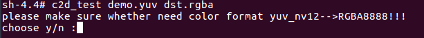
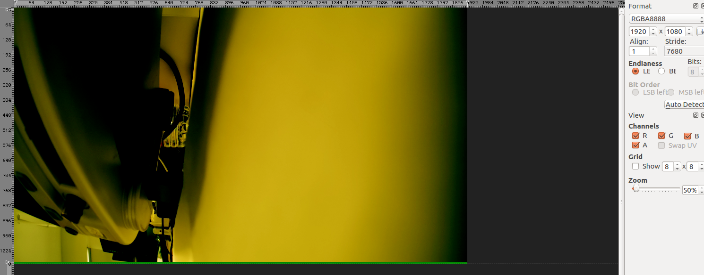
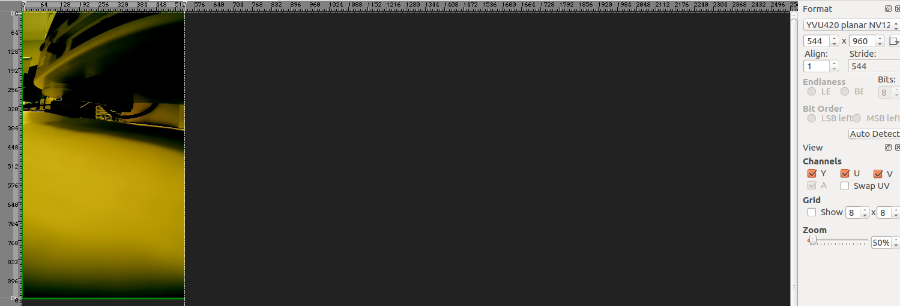

# C2D-Convert

# Overview
C2D-Sample-code shows picture color-format, picture rotate, picture scale-resize by C2D-Convert-API.Run c2d_test app, if you choose y, you will get the picture after color-format converted, if you choose n, you will get the picture after scale-resize and 90° rotate.
## 1. Init:
```
$ adb shell
$ cd /date
$ git clone https://github.com/quic/sample-apps-for-robotics-platforms.git
$ cd /date/C2D-Samples
$ wget https://dri.freedesktop.org/libdrm/libdrm-2.4.82.tar.bz2
$ sh set_env.sh
```

## 2. compile:
```
$ cd src
$ make
```

## 3. Run:
```
$ ./c2d_test demo.yuv dst
```
demo.yuv is src picture, dst is dst picture
after run this command , terminal will remind you choose y/n



choose y : the picture color format will change yuv_nv12-->RGBA8888 , the result such as color_format_dst.png

choose n : the picture will rotate 90° and scale 1/2 , the result such as rotate_scale_dst.png

## 4. Result
```
$ exit
$ adb pull <path to directory in Git repository>/C2D-Samples/src/dst .
```
View target image need to install 7yuv tool
## 5. 7yuv
```
If you already have the 7yuv tool installed, go ahead
1.Open 7yuv
2.Open demo.yuv and dst by 7yuv tool
3.On the right side of the software choose picture set
demo.yuv set:
Format : YUV420 planar NV12
size   : 1920*1088
dst set:
if you choose y when run c2d_test
Format : RGBA8888
size   : 1920*1088
if you choose n when run c2d_test
Format : YUV420 planar NV12
size   : 544*960
```
Expect:



## License
This is licensed under the BSD 3-Clause-Clear “New” or “Revised” License. Check out the [LICENSE](LICENSE) for more details.
