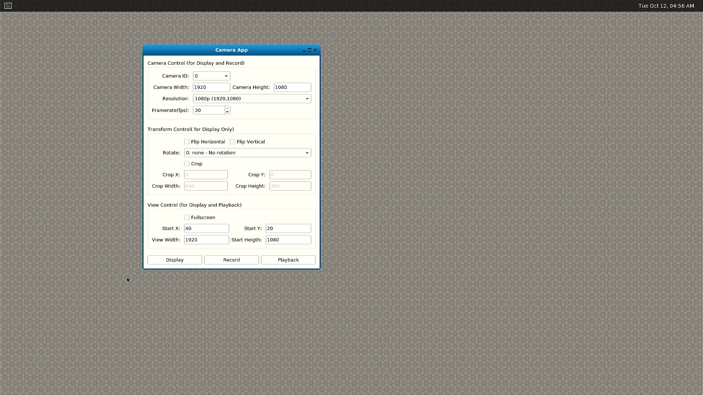

# Graphical User Interface Application

This sample shows a gui application which demonstrates camera display, camera recording, and mp4 playback. 


## Prerequisite on RB5

- Make sure to check python version.PyQt will require python 3.6 or above 
```bash
python --version
```
- Installing python dev tools & PyQt library 
```bash
apt-get install qt5-default qtwayland5 qtbase5-private-dev
apt-get install python3-dev
apt-get install python-qt5 
```
- Installing PyQt5 & PyQt5-tools 
```bash
pip install pyqt5
pip install pyqt5-tools
```
- Setting the Display variables 

```bash
export QT_QPA_PLATFORM=wayland
```


## GUI Application

### Launch ```gui_app```

+ Connect the board to screen through HDMI output
+ Connect keyboard and mouse to the board
+ Login on the screen
+ Turn on weston display with ```weston.sh```
``` bash
$ <path to directory in Git repository>/weston.sh
```
+ Click left-top button on weston display to open weston-terminal
+ Run ```gui_app``` in weston-terminal with **specifying the platform to wayland**
  
```bash
$ cd <path to directory in Git repository>/gui_app
python3 gui_app.py 
```


## Snapshot



## Settings

### Camera Settings

Camera settings set camera parameters for display and recording.

+ Camera ID (0~4)
+ Resolution: width and height
+ Framerate

### Transform Settings

Transform settings set transform parameters for display only.

+ Flip: horizontal or vertical
+ Rotate: 90CW, 90CCW, and 180
+ Crop: x, y, width, height

### View Settings

View settings set view parameters for display and playback.

+ Fullscreen
+ Location: x, y
+ Size: width and height


## Operations

There are 3 operations in this application.

### Display

+ Click ```Display``` button. Camera view will display on the screen.

+ Click ```Stop``` to stop display.

### Record

+ Click ```Record``` button. A file dialog will popup to specify the mp4 file name to be saved. Then recording will start. The camera view will also display on the screen.

+ Click ```Stop``` to stop recording.

### Playback

+ Click ```Playback``` button. A file dialog will popup to specify the mp4 file name to playback. Then playback will start. 

+ Click ```Stop``` to stop playback.

