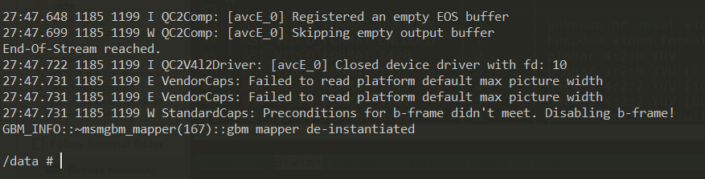
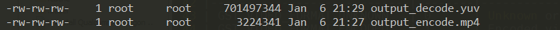

# Codec2-Video
```
A sample app based on gstreamer.
This app aims to help users to learn how to encode with h264 and decode the video with h264 on the Qualcom platform through this sample app.
```

## Download
Install RB5 LU SDK and source the environment
Download source code on PC.

## Compile
After executing make command, the executable program gst-codec2_h264 will be created.
```
$ cd Codec2-Video/
$ make
```

## Test
After compile the sample app, you are free to use the app to test the encode and decode.

###Encode 
The program will encode the yuv file in h264 codec to output_encode.mp4 and the output file will be put under ./test_video.
Notes: "/test_video" does not exist. You may need to find ".yuv" and ".mp4" files to test encode and decode. The following test results are for reference only.
Before the program starts encoding, you also need to input witdth, height, format, and framerate of images in raw stream in order, and press ENTER to input them. 
Note: number for format can be found in the table below.

```
For example, if we are encoding a 640 x 480, nv12(#23), 30fps raw stream 640x480.yuv which is located under /data, encode with the command below,
$ adb disable-verity
$ adb reboot
$ adb wait-for-device root
### The above three steps only need to be operated once and will always be valid.

$ ./gst-codec2_h264 encode <FILE>
//then input the properties of images in raw stream
$ 640 480 23 30

"FILE": absolute file path to the file you want to encode.
```


| Format                     | Number | Description                                                     |
|----------------------------|--------|-----------------------------------------------------------------|
| GST_VIDEO_FORMAT_UNKNOWN   | 0      | Unknown or unset video format id                                |
| GST_VIDEO_FORMAT_ENCODED   | 1      | Encoded video format.                                           |
| GST_VIDEO_FORMAT_I420      | 2      | planar 4:2:0 YUV                                                |
| GST_VIDEO_FORMAT_YV12      | 3      | planar 4:2:0 YVU (like I420 but UV planes swapped)              |
| GST_VIDEO_FORMAT_YUY2      | 4      | packed 4:2:2 YUV (Y0-U0-Y1-V0 Y2-U2-Y3-V2 Y4 ...)               |
| GST_VIDEO_FORMAT_UYVY      | 5      | packed 4:2:2 YUV (U0-Y0-V0-Y1 U2-Y2-V2-Y3 U4 ...)               |
| GST_VIDEO_FORMAT_AYUV      | 6      | packed 4:4:4 YUV with alpha channel (A0-Y0-U0-V0 ...)           |
| GST_VIDEO_FORMAT_RGBx      | 7      | sparse rgb packed into 32 bit, space last                       |
| GST_VIDEO_FORMAT_BGRx      | 8      | sparse reverse rgb packed into 32 bit, space last               |
| GST_VIDEO_FORMAT_xRGB      | 9      | sparse rgb packed into 32 bit, space first                      |
| GST_VIDEO_FORMAT_xBGR      | 10     | sparse reverse rgb packed into 32 bit, space first              |
| GST_VIDEO_FORMAT_RGBA      | 11     | rgb with alpha channel last                                     |
| GST_VIDEO_FORMAT_BGRA      | 12     | reverse rgb with alpha channel last                             |
| GST_VIDEO_FORMAT_ARGB      | 13     | rgb with alpha channel first                                    |
| GST_VIDEO_FORMAT_ABGR      | 14     | reverse rgb with alpha channel first                            |
| GST_VIDEO_FORMAT_RGB       | 15     | RGB packed into 24 bits without padding ( R-G-B-R-G-B )         |
| GST_VIDEO_FORMAT_BGR       | 16     | reverse RGB packed into 24 bits without padding ( B-G-R-B-G-R ) |
| GST_VIDEO_FORMAT_Y41B      | 17     | planar 4:1:1 YUV                                                |
| GST_VIDEO_FORMAT_Y42B      | 18     | planar 4:2:2 YUV                                                |
| GST_VIDEO_FORMAT_YVYU      | 19     | packed 4:2:2 YUV (Y0-V0-Y1-U0 Y2-V2-Y3-U2 Y4 ...)               |
| GST_VIDEO_FORMAT_Y444      | 20     | planar 4:4:4 YUV                                                |
| GST_VIDEO_FORMAT_v210      | 21     | packed 4:2:2 10-bit YUV, complex format                         |
| GST_VIDEO_FORMAT_v216      | 22     | packed 4:2:2 16-bit YUV, Y0-U0-Y1-V1 order                      |
| GST_VIDEO_FORMAT_NV12      | 23     | planar 4:2:0 YUV with interleaved UV plane                      |
| GST_VIDEO_FORMAT_NV21      | 24     | planar 4:2:0 YUV with interleaved VU plane                      |
| GST_VIDEO_FORMAT_GRAY8     | 25     | 8-bit grayscale                                                 |
| GST_VIDEO_FORMAT_GRAY16_BE | 26     | 16-bit grayscale, most significant byte first                   |
| GST_VIDEO_FORMAT_GRAY16_LE | 27     | 16-bit grayscale, least significant byte first                  |
| GST_VIDEO_FORMAT_v308      | 28       | packed 4:4:4 YUV (Y-U-V ...)                                    |
| GST_VIDEO_FORMAT_RGB16     | 29       | rgb 5-6-5 bits per component                                    |
| GST_VIDEO_FORMAT_BGR16     | 30       | reverse rgb 5-6-5 bits per component                            |
| GST_VIDEO_FORMAT_RGB15     | 31       | rgb 5-5-5 bits per component                                    |
| GST_VIDEO_FORMAT_BGR15     | 32       | reverse rgb 5-5-5 bits per component                            |
| ... | ... | ...

For more format information, you can refer to [Gstreamer Videoparse Format Reference](https://gstreamer.freedesktop.org/documentation/video/video-format.html?gi-language=c#GstVideoFormat).

Sample.yuv (flower_cif.yuv) can be put under ./test_video to test encode

###Decode
The program will decode a sample mp4 file in h264 codec to output_decode.yuv and the output file will be put under ./test_video
```
$ ./gst-codec2_h264 decode <FILE>

"FILE": absolute file path to the file you want to decode.
```



## License
This is licensed under the BSD 3-clause-clear "New" or "Revised" License. Check out the [LICENSE](LICENSE) for more details.
