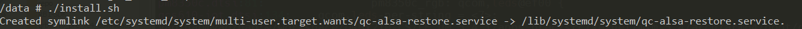
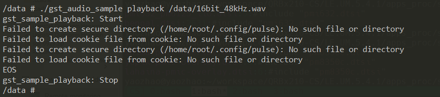
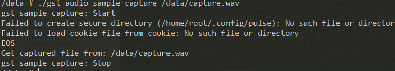
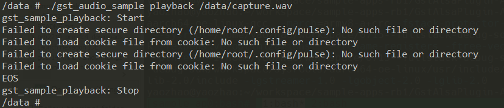

# GstAlsaPlugin-Application
```
A sample app based on gstreamer
The purpose is helping users to learn how to implement the playback and recording functions of gstreamer+alsa
on the QTI platform through this sample app.
```

# Get Start


### Compile
After execute the make command, the binary gst_audio_sample will be created.
```
# cd <path to directory in Git repository>/gst_alsa/src
# make
# make install
```

## QC ALSA restore service (Once need to execute once)
We provided a ALSA restore service, to enable speaker and dmic as default.
Please follow the steps to enable it
```
adb shell
cd /data
./install.sh
```



After enable this HWConfig service, please reboot the device:
```
# exit
$ adb reboot
```

BTW, if you want to disable this service, please run:
```
systemctl disable qc-alsa-restore
```

### Test
After compile the sample code, and enable service.
We can use the app to test with playback and capture.
###  Playback
For playback, please use below command to playback.
You need to choose your demo.wav audio file.
```
# cd /data
# ./gst_audio_sample playback /data/16bit_48kHz.wav
```


### Capture
Below command will record about 10 seconds
```
# ./gst_audio_sample capture /data/capture.wav
```
After record, we can verified it by playback
```
# ./gst_audio_sample playback /data/capture.wav
```



## License
This is licensed under the BSD 3-Clause-Clear “New” or “Revised” License. Check out the [LICENSE](LICENSE) for more details.
