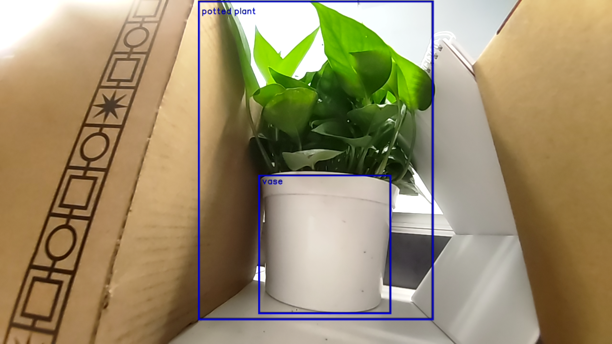

## 1. Set up the environment
Install RB5 LU SDK and source the environment
Download sample code on PC

## 2. Modify & Compile the tflite demo app
```
Gstreamer App demo provides two methods, it can
be used either Gstreamer command line via
gst_parse_launch or GST API to build pipeline.
It sets to API method by default. Switch to command line methods:
$ vi tflite_classification.c

+#define PARSER

To Run the install script:
   $ cd <path to directory in Git repository>/gst_tflite
   $ sh install.sh
```

```shell
    sh-4.4# cd <path to directory in Git repository>/gst_tflite/src
    sh-4.4# make
```

## 3. Push resources to the device
```
$ adb push tflite_classification /data
$ adb push mobilenet_v2_1.0_224_quant_.tflite /data
$ adb push mobilenet.labels /data
```

## 4. Run the demo app
```
+ Click left-top button on weston display to open weston-terminal
+ Run ```./tflite_object_detection``` in weston-terminal 

```shell
    sh-4.4# ./tflite_object_detection
```



## License
This is licensed under the BSD 3-clause-Clear “New” or “Revised” License. Check out the [LICENSE](LICENSE) for more details.
