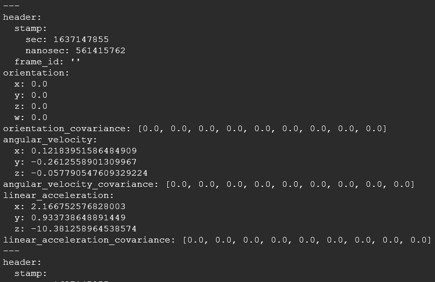

# Access IMU Sensor Data on Qualcomm Robotics RB5, using ROS2 nodes 

This document shows how to run a C++ ROS2 node that reads data from an IMU sensor.                                                                     
It also showcases the IMUD daemon/library sample code, so you can build your own IMU node.
This directory consists of 
- sensor-daemon: the IMUD service to access IMU data from DSP.
- sensor-client: the library for communicating with IMUD.
- imu-ros2node: the sample implementation of IMU node based on ROS2.

Note - All these components are built-in in Qualcomm Robotics RB5 image as binary programs.

Once network is setup on Qualcomm Robotics RB5, follow these pre-requisite steps to setup ROS2

## 1.	Download and Install ROS2 
1.1.	Log in to Qualcomm Robotics RB5 through adb, In a terminal window enter -
```bash
adb shell
```

1.2.	Install ROS2 via Debian packages                                                                                         
•	Install and Update locales
```bash
apt update && apt install locales
locale-gen en_US en_US.UTF-8
update-locale LC_ALL=en_US.UTF-8 LANG=en_US.UTF-8
export LANG=en_US.UTF-8
```
•	Install curl, Download GPG key and add ROS repository to sources list
```bash
$ sudo apt install software-properties-common 
$ sudo add-apt-repository universe
# Add ROS GPG key
$ sudo apt update && sudo apt install curl -y
$ sudo curl -sSL https://raw.githubusercontent.com/ros/rosdistro/master/ros.key -o /usr/share/keyrings/ros-archive-keyring.gpg
# Add ROS repository to your sources list
$ echo "deb [arch=$(dpkg --print-architecture) signed-by=/usr/share/keyrings/ros-archive-keyring.gpg] http://packages.ros.org/ros2/ubuntu $(. /etc/os-release && echo $UBUNTU_CODENAME) main" | sudo tee /etc/apt/sources.list.d/ros2.list > /dev/null

```
•	Update system packages and install ROS
```bash
apt update
apt install ros-foxy-desktop 
```
Wait until all ROS2 packages are installed.


## 2. Setup ROS environment and Verify ROS2 installation
Enter the following commands
```bash
echo 'source /opt/ros/foxy/setup.bash' >> ~/.bashrc
echo 'export ROS_DOMAIN_ID=30' >> ~/.bashrc
mkdir ~/my_ros_logs
echo 'export ROS_HOME=~/my_ros_logs' >> ~/.bashrc
source ~/.bashrc
ros2
```
This will display ros2 help messages if installation is succesfull.

## 3.	Run IMU ROS node
3.1 Clone the sample app and re-build ROS2 to include IMU Node

In a terminal window, enter the following commands 
```bash
adb shell
cd /data
git clone https://github.com/quic/sample-apps-for-robotics-platforms.git
cd ~ && mkdir ~/ros_ws
mv <path to directory in Git repository>/imu-ros2node ~/ros_ws/
# Install colcon
apt install python3-argcomplete && python3-colcon-common-extensions
# Re-build ROS 
cd ~/ros_ws
source /opt/ros/dashing/setup.bash
colcon build
cd ~/ros_ws
. install/local_setup.sh
```
3.2 Run the IMU ROS node sample 
    
In terminal 1, run
```bash
source ~/.bashrc
ros2 run imu-ros2node imu-ros2node
```
In terminal 2 , run
```bash
source ~/.bashrc  
ros2 topic echo /imu
```

Pick up RB5 and shake it, you can see the IMU data changing in the terminal logs:



## License
This is licensed under the BSD 3-clause-Clear “New” or “Revised” License. Check out the [LICENSE](LICENSE) for more details.


