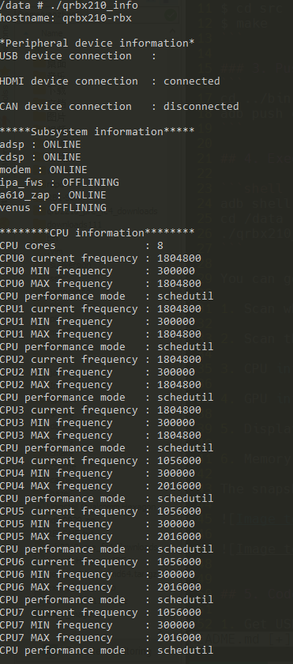
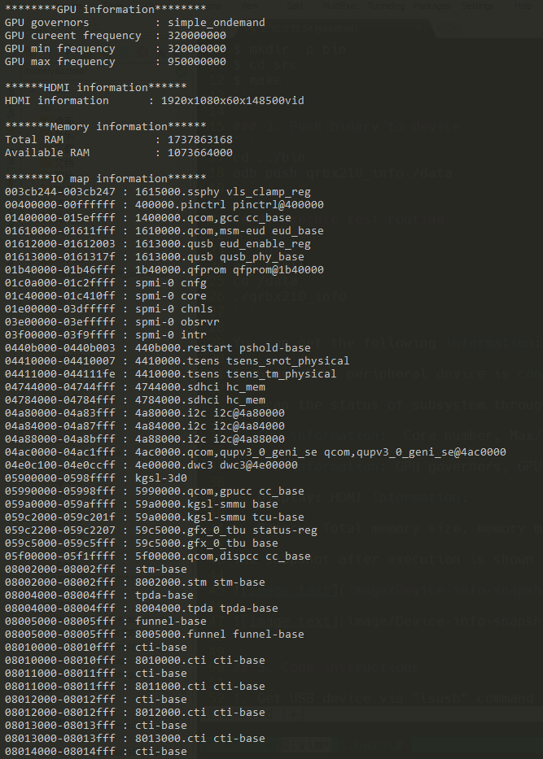
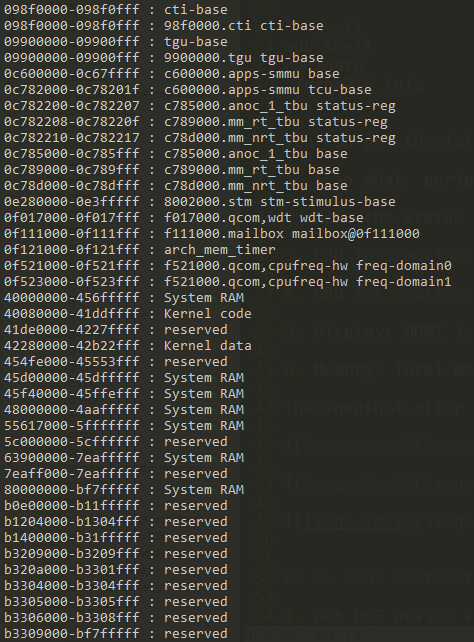

# RB5 Information User Guide

### 1. Set up the environment on PC
Install RB5 LU SDK and source the environment
Download sample code to PC

### 2. Compile
```
$ cd Device-info
$ mkdir -p bin
$ cd src
$ make
```

### 3. Push binary to device
```
cd ../bin
adb push qrb5165_info /data
```

## 4. Execute test routine

```shell
adb shell
cd /data
$ adb disable-verity
$ adb reboot
$ adb wait-for-device root
### The above three steps only need to be operated once and will always be valid.

chmod +x ./qrb5165_info
./qrb5165_info
```

You can get the following information:

1. Scan what  peripheral device is connected. (usb/hdmi/can device)

2. Scan the status of subsystem through kernel node. offline or online.

3. CPU information:  Core number, Max/Min frequency for every core, current frequency. performance mode.

4. GPU information: GPU governors, GPU cureent frequency, GPU min frequency, GPU max frequency.

5. Display: HDMI information. 

6. Memory: Total memory size, memory map of subsystem, available HLOS memory size.

The snapshot after execution is shown below:








## 5. Code instructions

1. Get USB device via "lsusb" command

2. Check to if the HDMI device is connected through the node "/sys/class/drm/card0-DSI-1/status"

3. Check to if the HDMI device is connected through the node "/sys/class/net/can0/flags", determines if there is a RUNING flag

4. Get subsystem information: 

   Get the name from the node "/sys/bus/msm_subsys/devices/subsys*/name" ;

   Get the status from the node "/sys/bus/msm_subsys/devices/subsys*/state" ;

   It's good for RB5 will show "Can not open file: /sys/bus/msm_subsys/devices/subsys5/name get subsystem name error!",
   cause RB5 doesn't have cdsp.

5. Get CPU core number through the node "/proc/cpuinfo"

6. Get CPU every core frequency from the node "/sys/devices/system/cpu/cpu*/cpufreq/"

7. Get GPU information from the node "/sys/devices/platform/soc/5900000.qcom,kgsl-3d0/devfreq/5900000.qcom,kgsl-3d0/"

8. Get display resolution from the function: int sysinfo(struct sysinfo *info);

9. Get memory map from the node "/proc/iomem"

## License
This is licensed under the BSD 3-Clause-Clear “New” or “Revised” License. Check out the [LICENSE](LICENSE) for more details.
