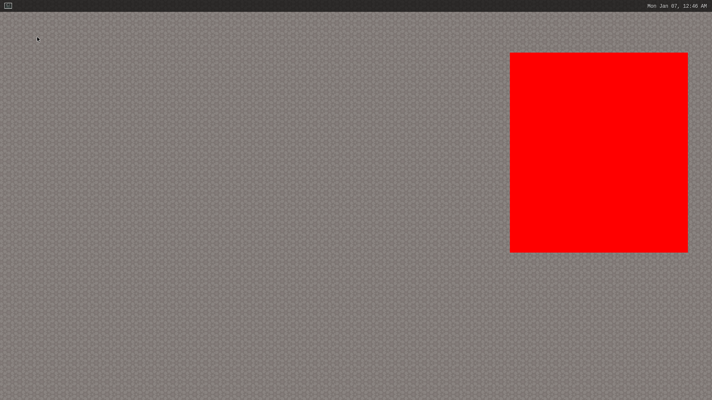
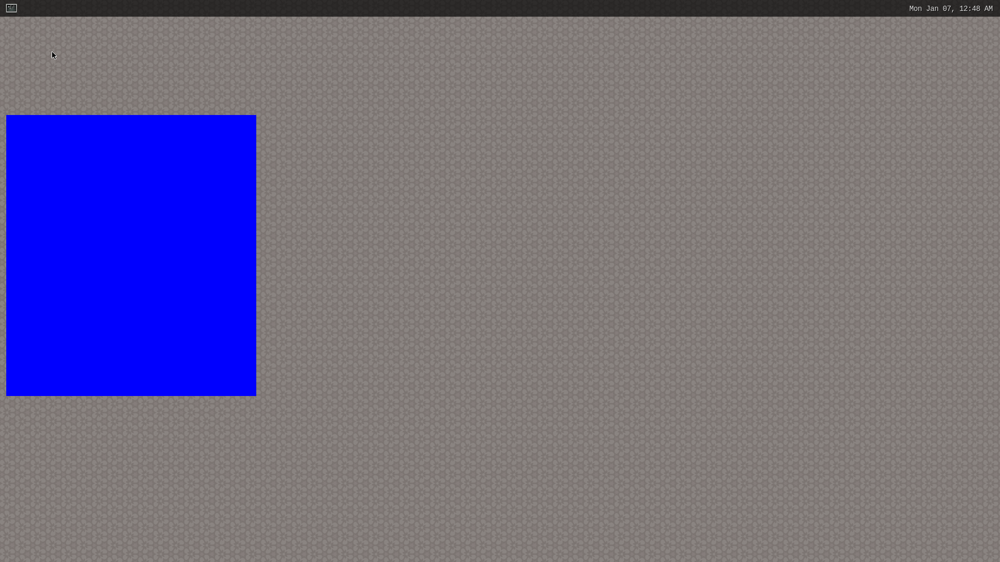
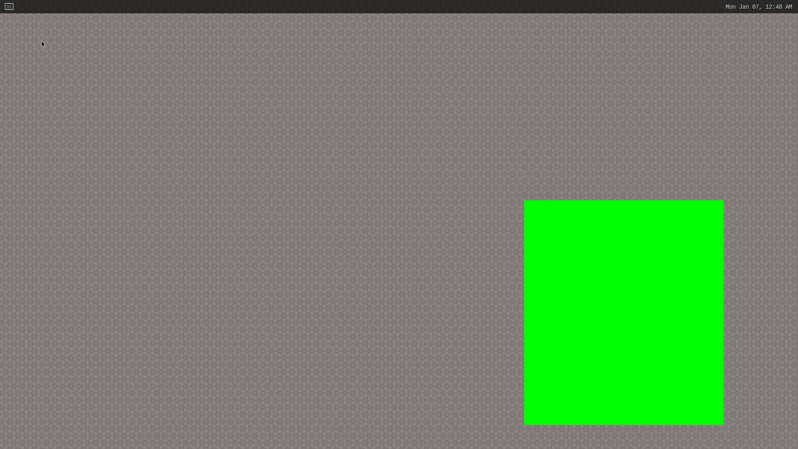

# Weston-client-sample
# Overview
Weston-Sample-code shows how to compile and run a simple client in Weston.

## 1. Init:
Install RB5 LU SDK and source the environment on PC
Download the sample code on PC

## 2. Compile the demo app
```
$ cd Weston-Client-Application
$ $CC -o test simple-egl.c -lwayland-client -lwayland-egl -lEGL -lGLESv2
```

## 3. Push the binary to device
```
$ adb disable-verity
$ adb reboot
$ adb wait-for-device root
### The above three steps only need to be operated once and will always be valid.

$ adb push test /data
$ adb shell
$ export XDG_RUNTIME_DIR=/run/user/root
$ cd data
```

## 4. Open weston's terminal, enter the following command in the terminal to run the example:
Show red window:
```
$ ./test -r
```
Expect:


Show blue window:
```
$ ./test -b
```
Expect:


Show green window:
```
$ ./test -g
```
Expect:


## 5. Type ‘stop’ in the terminal to close the window.

## License
This is licensed under the BSD 3-Clause-Clear “New” or “Revised” License. Check out the [LICENSE](LICENSE) for more details.
