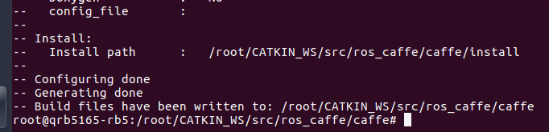

## 1  Set up the ROS environment
 **1、 Connect the network and set the source**
```
$ adb shell
$ su
$ sh -c '. /etc/lsb-release && echo "deb http://mirrors.ustc.edu.cn/ros/ubuntu/ $DISTRIB_CODENAME main" > /etc/apt/sources.list.d/ros-latest.list'
```
**2、set the public key and update api**
```
$ gpg -a --export F42ED6FBAB17C654 > ros_public_key
// If there is a problem executing the above command, you can execute it in Ubuntu and push the ros_public_key file to the / directory of the board.
$ apt-key add ros_public_key
```

```
$ apt-get update
```


**3、install the ROS**
```
$ apt-get install ros-melodic-desktop-full
```
**4、Add the environment variable and install dependency package**
 ```
$ echo "source /opt/ros/melodic/setup.bash" >> ~/.bashrc
$ source ~/.bashrc
$ apt install python-rosinstall python-rosinstall-generator python-wstool build-essential
 ```

## 2  Set up the ROS workspace
**1、Install catkin_pkg**
```
$ apt-get install python-pip
$ pip install catkin_pkg
```
**2、Create and compile the workspace**
```
$ mkdir -p ~/CATKIN_WS/src
$ cd  ~/CATKIN_WS
$ catkin_make
```

## 3  Install the Ros_Caffe
**1、download the source**
```
$ git clone https://github.com/sdinesh-94/ros_caffe_2.0
$ mv ros_caffe_2.0 ros_caffe
$ git clone https://github.com/BVLC/caffe.git
```
**2、modife the caffe code** 

```
$ git clone https://github.com/quic/sample-apps-for-Qualcomm-Robotics-RB5-platform.git
$ cd ROS-Caffe
$ cp window_data_layer.patch ../caffe/src/caffe/layers/
$ cd ../caffe/src/caffe/layers/
$ patch -p0 window_data_layer.cpp window_data_layer.patch
$ cd -

$ cp io.patch ../caffe/src/caffe/util/
$ cd ../caffe/src/caffe/util/
$ patch -p0 io.cpp io.patch
$ cd -

$ cp CMakeLists.patch ../ros_caffe/
$ cd ../ros_caffe/
$ patch -p0 CMakeLists.txt CMakeLists.patch
$ cd ..

$ cp -r caffe ros_caffe/
$ cp -r ros_caffe /root/CATKIN_WS/src/
$ cp -r ROS-Caffe/data /root/CATKIN_WS/src/ros_caffe
$ cd /root/CATKIN_WS/src/ros_caffe/data/
$ wget http://dl.caffe.berkeleyvision.org/bvlc_reference_caffenet.caffemodel
```
**3、Install dependency package**
```
$ apt-get install libgflags-dev libgoogle-glog-dev libhdf5-serial-dev libleveldb-dev libsnappy-dev liblmdb-dev libatlas-base-dev libboost-python-dev
```

## 4  Compile the Ros_Caffe
**1、Compile caffe**
```
$ cd /root/CATKIN_WS/src/ros_caffe/caffe/
$ cmake .
```


```
$ make all
```


**2、compile the ROS**
```
$ cp /usr/include/hdf5/serial/* /root/CATKIN_WS/src/ros_caffe/caffe/include/caffe/
$ cd ~/CATKIN_WS
$ catkin_make
$ source devel/setup.bash
$ cd /root/CATKIN_WS/src/ros_caffe/
$ cmake .
```

```
$ make
```

```
Open a terminal, execute
$ adb shell
$ cd /root/CATKIN_WS/src/ros_caffe/
$ source devel/setup.bash
$ roscore
```

```
Open another terminal, execute
$ adb shell
$ cd /root/CATKIN_WS/src/ros_caffe/
$ source devel/setup.bash
$ rosrun ros_caffe ros_caffe_test
```


## License
This is licensed under the BSD 3-clause-Clear “New” or “Revised” License. Check out the [LICENSE](LICENSE) for more details.
