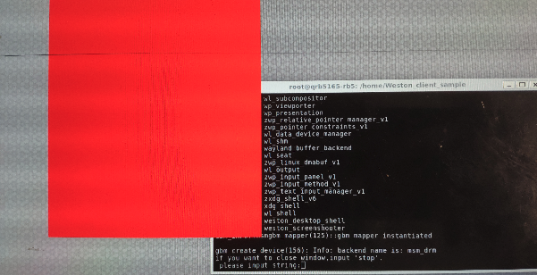
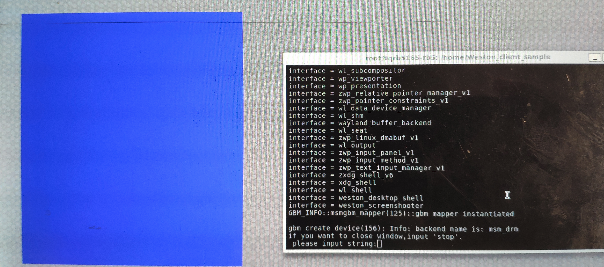
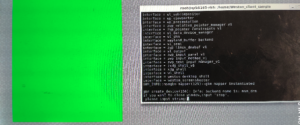

# Weston-client-application
# Overview
Weston-Sample-code shows how to compile and run a simple client in Weston.

## 1. Init:
```
$ adb shell
$ cd home
$ git clone https://github.com/quic/sample-apps-for-Qualcomm-Robotics-RB5-platform.git
$ cd sample-apps-for-Qualcomm-Robotics-RB5-platform
$ cd Weston-Client-Application
```

## 2. compile
```
$ gcc -o test simple-egl.c -lwayland-client -lwayland-egl -lEGL -lGLESv2
```

## 3. Run:
### 1) Enter the following command in the local terminal:
```
$ adb reboot-bootloader
$ fastboot oem select-display-panel none
$ sudo fastboot reboot
```
### 2) power off and power on device:

### 3) After the development board starts:
```
$ adb shell
cd /home/sample-apps-for-Qualcomm-Robotics-RB5-platform/Weston-Client-Sample
$ sh weston.sh
```
### 4) Open weston's terminal, enter the following command in the terminal to run the example:
Show red window:
```
$ ./test -r
```
Expect:


Show blue window:
```
$ ./test -b
```
Expect:


Show green window:
```
$ ./test -g
```
Expect:


### 5) Type ‘stop’ in the terminal to close the window.

## License
This is licensed under the BSD 3-Clause-Clear “New” or “Revised” License. Check out the [LICENSE](LICENSE) for more details.
