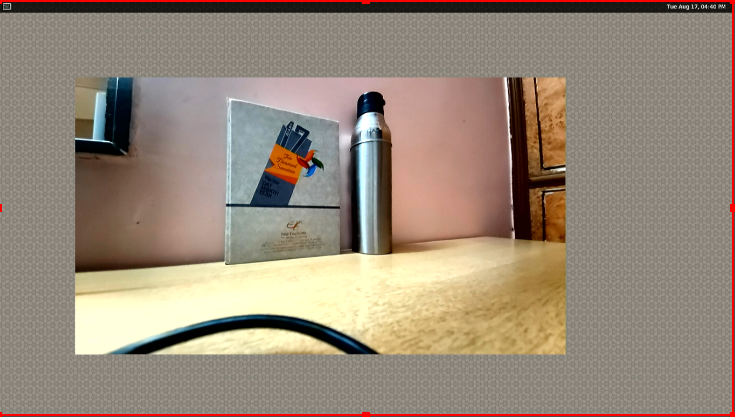
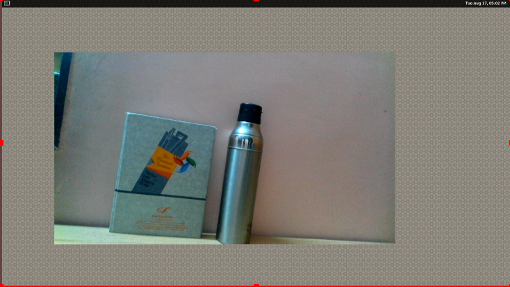

# Camera Liveview Display

These samples show camera liveview on weston display. 

There are two samples. One is display from ISP camera (main onboard camera). The other is display from USB camera.

## Install Tool

To display USB camera, v4l2-ctl is a useful tool to list the device files of the camera. It can be installed from v4l-utils pacakge.

```bash
$ adb shell
$ apt install v4l-utils
```

## Display from ISP Camera

```ispcam_display``` displays ISP camera liveview on weston display.

Usage: ispcam_display [camera id: 0]

### Start Camera Display:

+ Connect the board to screen through HDMI output/USB capture card.
+  Turn on weston display with  `weston.sh`
	```
	/gst-python-samples/Gstreamer-Applications/weston.sh
	```
+ Run ```ispcam_display``` on RB5 to display camera 0 on weston display
	```bash
	cd /gst-python-samples/Gstreamer-Applications/gst_camera
	export XDG_RUNTIME_DIR=/dev/socket/weston
	python3 ispcam_display.py 0
	```
   *ispcam-display*

### Stop Camera Display:

+ Press Ctrl-C to stop display on RB5
  
## Display from USB Camera

```usbcam_display``` displays USB camera liveview on weston display.

Usage: usbcam_display </dev/videoX>

### Find device file of the camera:

+ Use **v4l2-ctl --list-devices** to list device files of all camera
+ Find the device file of the USB camera. Not all video device files can be displayed
	```bash
	$ v4l2-ctl --list-devices
	<Some camera information> (<some usb infomation>):
		/dev/video0
		/dev/video1
	```

### Start Camera Display:

+ Connect the board to screen through HDMI output
+  Turn on weston display with  `weston.sh`
	```
	/gst-python-samples/Gstreamer-Applications/weston.sh
	```
+ Run ```usbcam_display``` on RB5 to display camera /dev/video0
on weston display.
	```bash
	cd /gst-python-samples/Gstreamer-Applications/gst_camera
	export XDG_RUNTIME_DIR=/dev/socket/weston
	$ python3 usbcam_display.py /dev/video0
	```
   *usbcam-display*
### Stop Camera Display:

+ Press Ctrl-C to stop display

### No Display Problem:

A successful display depends on correct setting of resolution and framerate for the camera. If the display not shown for the camera, try to apply lower resolution and framerate for the camera.

```C
# usbcam_display.py

# we set the filter parameter for videorate 
framefilter.set_property("caps",

Gst.caps_from_string("video/x-raw,framerate=15/1,width=1280,height=720"))
```