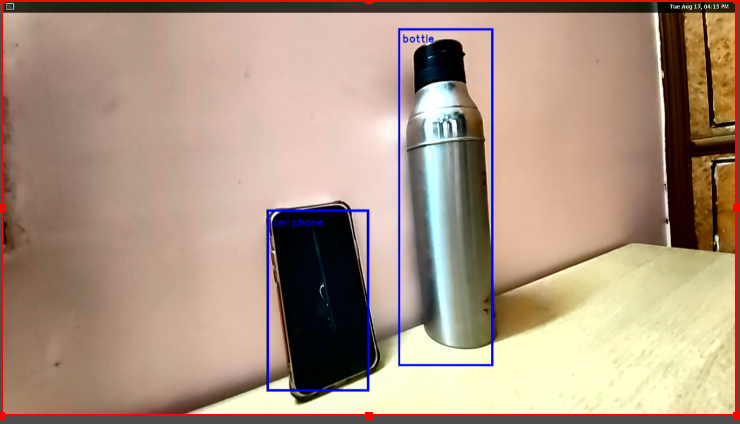

# RB5 TensorFlow Lite Demo: Object Detection User Guide

## 1. Init and set up the environment

 - Run the script: install.sh

```
$ cd /gst-python-samples/Gstreamer-Applications/gst_tflite
sh install.sh
```

+ Connect the board to screen through HDMI output/USB capture card.
+  Turn on weston display with  `weston.sh`
```
/gst-python-samples/Gstreamer-Applications/weston.sh
```

## 2. Run the tflite demo app
+ Run in RB5-terminal

```shell
$ cd /gst-python-samples/Gstreamer-Applications/gst_tflite
$ export XDG_RUNTIME_DIR=/dev/socket/weston
$ python3 tflite_object_detection.py
```
*Object Detection*
