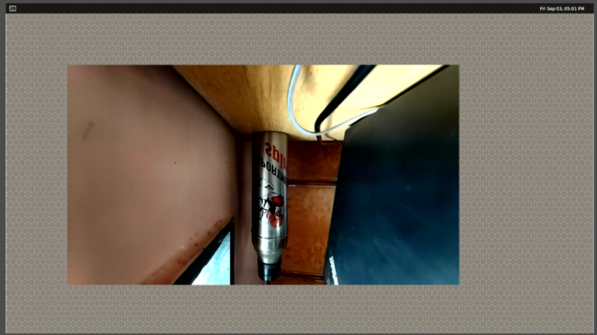
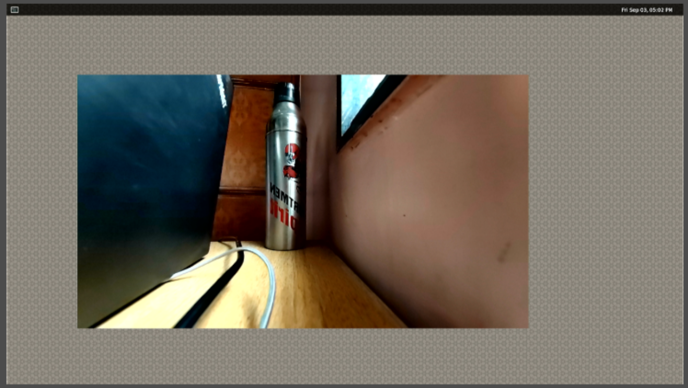
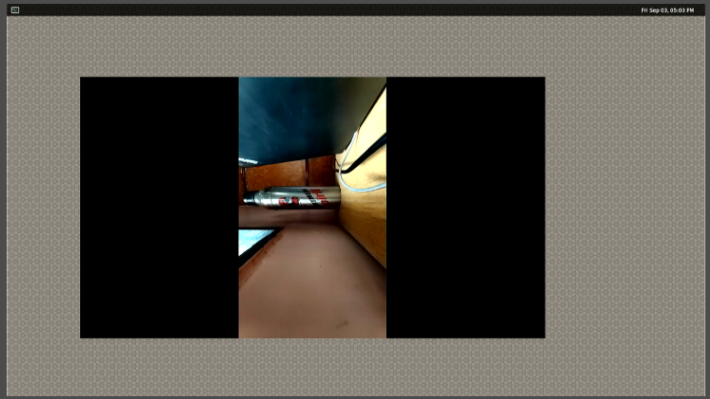

# Video Transform

This sample shows how to transform ISP camera video to weston display.

## Run Sample

```transform_video``` transforms ISP camera video to weston display.

Usage: transform_display [camera id: 0|1|2|3] [Operation]

Operation:

    flip v|h (v:vertical, h:horizontal)
    rotate 1|2|3  (1:90CW, 2:90CCW, 3:180)
    crop x y width height

Apply one operation at a time.

### Start Transform Display:

+ Connect the board to LCD monitoer/Laptop screen through HDMI output/USB capture card.
+ Turn on weston display with ```weston.sh```
```
  /gst-python-samples/Gstreamer-Applications/weston.sh
```
+ Run ```transform_display``` on RB5 to transform camera video
```bash
$ cd /gst-python-samples/Gstreamer-Applications/gst_transform
$ export XDG_RUNTIME_DIR=/dev/socket/weston
$ python3 transform_display.py 0 flip v
```
Example to transform video from camera 0:
``` bash
$cd /data/Gstreamer-Applications/gst_transform
$ python3 transform_display.py 0 flip v
$ python3 transform_display.py 0 flip h
$ python3 transform_display.py 0 rotate 2
$ python3 transform_display.py 0 10 10 960 540
```
The output screenshots of examples in the follow:
   *Fig 1 : Flip Vertical- flip v*

   *Fig 2 : Flip Horizontal - flip h*

   *Fig 3 : rotate 2*

   *Fig 4 : crop*


### Stop Transform Display:
+ Press Ctrl-C to stop display
