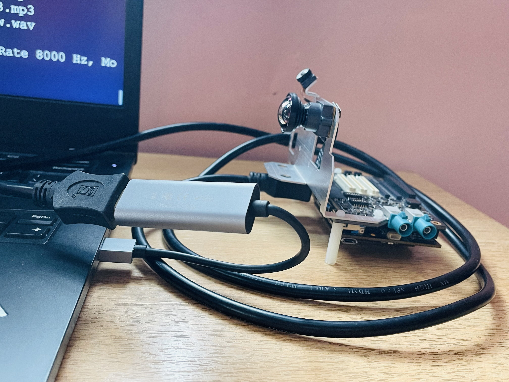
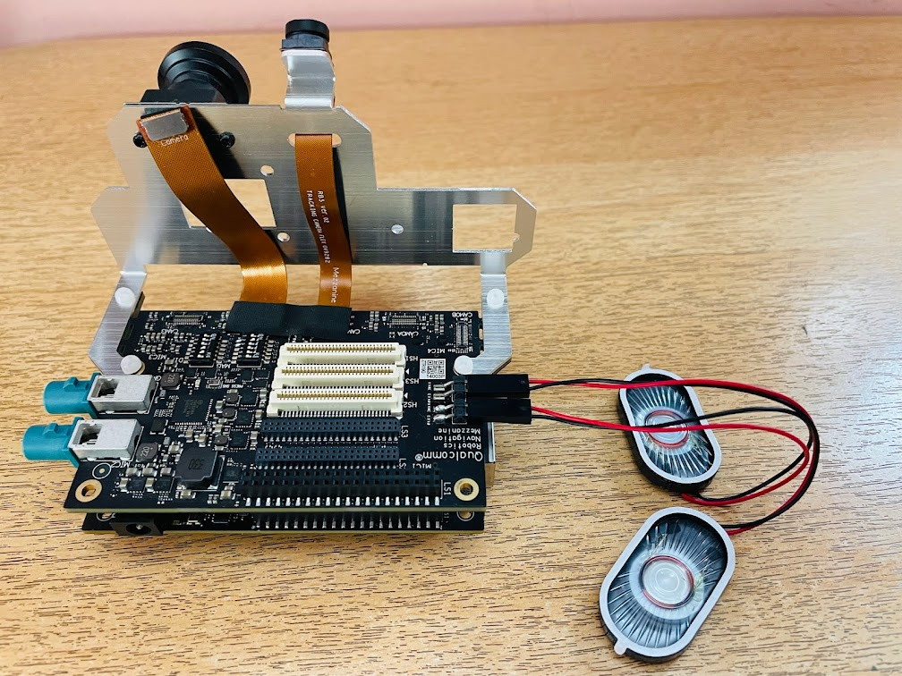
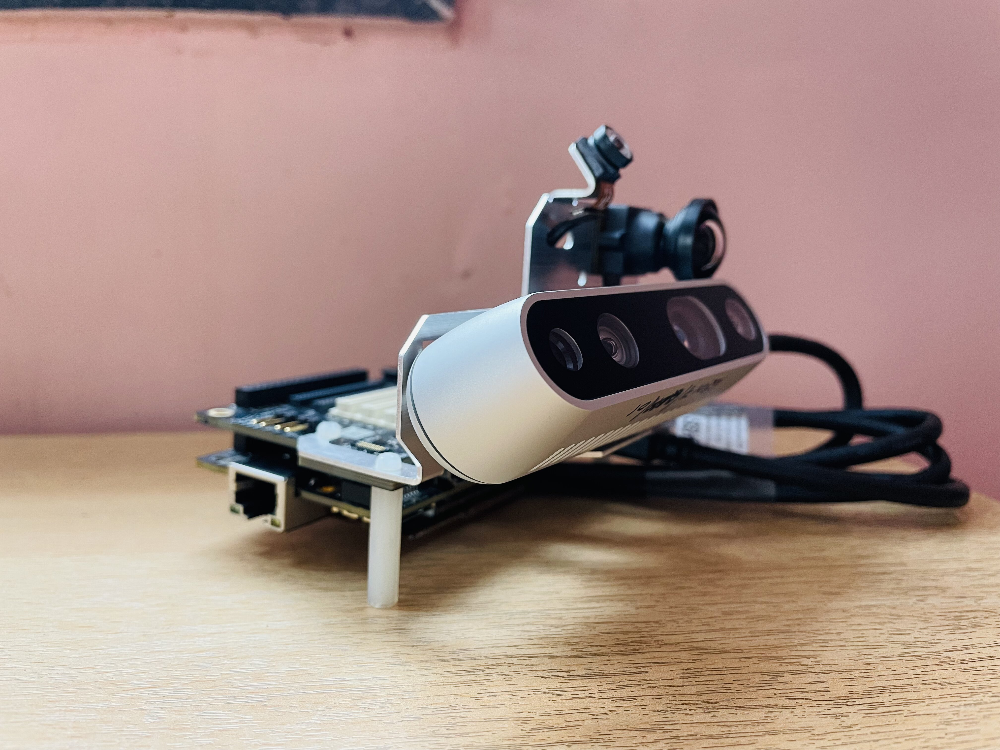

# Gstreamer Applications

The purpose of these samples is helping users to learn how to implement the functions of gstreamer on the Qualcomm platform with the python . These samples include

-   Camera display
-   Video encoding and decoding
-   Audio recording and playback
-   Video streaming
-   Gst TFlite
-   Gst AlsaPlugin
-   GUI application
-   Video transform

# Get Started
## I. Prerequisites:
Below are few prerequisites to run the gstreamer application on RB5.

### 1. Update the firmware to latest in RB5
**Note** : Latest firmware - **Linux qrb5165-rb5 4.19.125 #1 SMP PREEMPT Wed May 12 20:53:29 CST 2021 aarch64 aarch64 aarch64 GNU/Lin.**

- Command to check the version
```
$ uname -a command 
```
### 2.  Install GStreamer on RB5
```
$ apt-get install libgstreamer1.0-dev libgstreamer-plugins-base1.0-dev libgstreamer-plugins-bad1.0-dev gstreamer1.0-plugins-base gstreamer1.0-plugins-good gstreamer1.0-plugins-bad gstreamer1.0-plugins-ugly gstreamer1.0-libav gstreamer1.0-doc gstreamer1.0-tools gstreamer1.0-x gstreamer1.0-alsa gstreamer1.0-gl gstreamer1.0-gtk3 gstreamer1.0-qt5 gstreamer1.0-pulseaudio
```
### 3. Install OBS Studio 
Install OBS studio application from https://obsproject.com/ on the Laptop/LCD monitor to use it as weston display.

### 4. Download sample applications
Create a directory gst-python-samples on RB5 and download the source code from the gitlab.

```
$ adb shell
$ cd /home
$ git clone https://github.com/quic/sample-apps-for-Qualcomm-Robotics-RB5-platform.git
$ cd sample-apps-for-Qualcomm-Robotics-RB5-platform/gst-python-samples

```
### 5. Install Tool 
To display a USB camera, v4l2-ctl is a useful tool to list the device files of the camera. It can be installed from the v4l-utils package.
```
adb shell 
apt install v4l-utils
```
- Check the list of devices for all camera:
```
$ v4l2-ctl --list-devices
<Some camera information> (<some usb information>):
/dev/video0
/dev/video1
```

## II. Hardware connection setup instruction
Below are few hardware connection setup required for weston display and camera and connection for the Laptop/LCD monitor from RB5.


### 1. Setup Laptop/LCD monitor as a weston display
Connect RB5 and LCD monitor/Laptop with the help of a USB capture card   and HDMI cable.

   *Fig 1 : Connection of RB5 and LCD monitor with USB capture card.*

**Note** : For more information about setup HDMI and weston display please refer to the RB5 Gstreamer Plugin use case  document present in the downloaded directory path **gst-python-samples/Rb5-Gstreamer-Plugin-Usecase.docx**

### 2. RB5 Setup
- Attach the Mezzanine Board on top of RB5.
- Attach the speaker to the mezzanine.
- Attach USB Camera to RB5.
- Turn on weston display with weston.sh
```
$ sample-apps-for-Qualcomm-Robotics-RB5-platform/gst-python-samples/Gstreamer-Applications/weston.sh
```
   *Fig 2 : RB5 connection setup with  mezzanine board and speaker. 
.*

   *Fig 3 : RB5 Connection setup  with USB and ISP camera.
.*

- Open the OBS application and under the Source section add  a Video Capture Device.

### Compile

Run Samples

Please see detail in each folder.

gst_audio/

-   audio_record
-   audio_playback

gst_camera/

-   ispcam_display
-   usbcam_display

gst_encode_decode/

-   ispcam_encode_mpeg
-   usbcam_encode_mpeg
-   mp4_decode_playback

gst_streaming/

-   tcp_server
-   RTSP instruction


gst_tflite/

-   tflite_object_detection

gst_alsa/

- gst_audio_sample

gst_transform/

- transform_display
  
gst_gui_app/

- gui_app