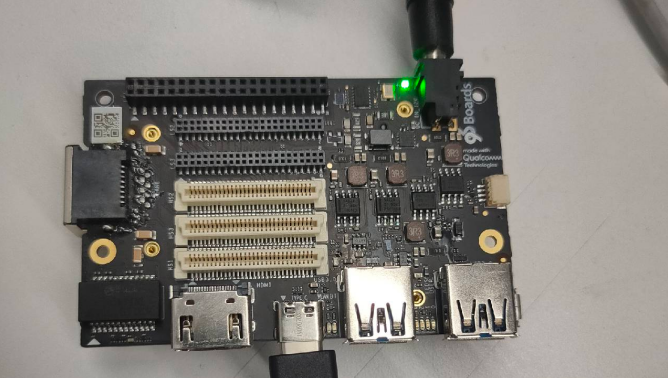

# Kernel Demo
# Overview
The kernel demo uses the kernel API to dynamically load and unload the kernel module to control the LED switch.

## 1.  Init
### 1.1 Set kernel environment
```
$ adb shell
$ apt-get install bison flex
```
### 1.2 Build kernel scripts
```
$ cd /usr/src/header
$ make scripts
```
### 1.3 Download source code
```
$ cd /data
$ git clone https://github.com/quic/sample-apps-for-Qualcomm-Robotics-RB5-platform.git
```
## 2. Build
```
$ cd kernel-demo/
$ make
```
## 3. Run

// Open LED
```
$ insmod led.ko
```


// Close LED
```
$ rmmod led.ko
```


## License
This is licensed under the BSD 3-clause-Clear “New” or “Revised” License. Check out the [LICENSE](LICENSE) for more details.
